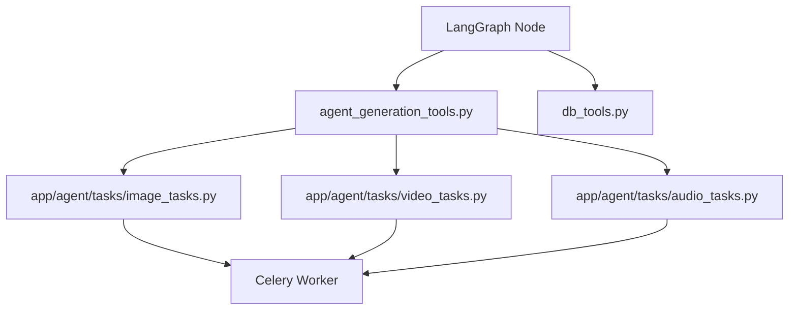

# Agent Tools 目录

本目录包含 LangGraph Agent 使用的工具（Tools）。

## 工具文件说明

| 文件 | 描述 | 使用场景 |
|------|------|----------|
| `agent_generation_tools.py` | 生成类工具 | 图片、视频、音频生成的批量任务派发 |
| `db_tools.py` | 数据库工具 | Creation/Scene/Shot/Character 的 CRUD 操作 |
| `editing_tools.py` | 编辑工具 | 内容编辑和修改操作 |
| `review_tools.py` | 审核工具 | 内容审核和质量检查 |
| `knowledge_tools.py` | 知识工具 | RAG 检索和知识库操作 |
| `narration_audio_tagger.py` | 旁白标注 | 旁白音频的智能标注 |

## 目录结构

```
tools/
├── __init__.py              # 工具导出
├── agent_generation_tools.py # 生成工具（高层封装）
├── db_tools.py              # 数据库操作工具
├── editing_tools.py         # 编辑相关工具
├── review_tools.py          # 内容审核工具
├── knowledge_tools.py       # 知识库工具
├── narration_audio_tagger.py# 旁白标注工具
└── async_db.py              # 异步数据库上下文
```

## 工具架构



## 使用说明

### 生成工具 (`agent_generation_tools.py`)

提供批量生成接口，内部调用 Celery Tasks：

- `generate_shot_images(creation_uuid)` - 批量生成分镜图片
- `generate_shot_videos(creation_uuid)` - 批量生成分镜视频
- `generate_character_image(...)` - 生成单个角色图片
- `generate_scene_image(...)` - 生成单个场景图片

### 数据库工具 (`db_tools.py`)

提供 Creation 生命周期的完整操作：

- `create_scene(...)` / `update_scene(...)` - 场景管理
- `save_shots(...)` / `update_shot(...)` - 分镜管理
- `query_shots(...)` / `query_shot_detail(...)` - 数据查询
- `save_shot_prompts(...)` / `save_video_prompts(...)` - 提示词管理

## 注意事项

1. **异步调用**：所有工具都是异步函数，需要使用 `await tool.ainvoke(...)` 调用
2. **Celery 依赖**：生成工具需要 Celery Worker 运行
3. **参考图支持**：分镜图生成支持角色图和场景图作为参考
