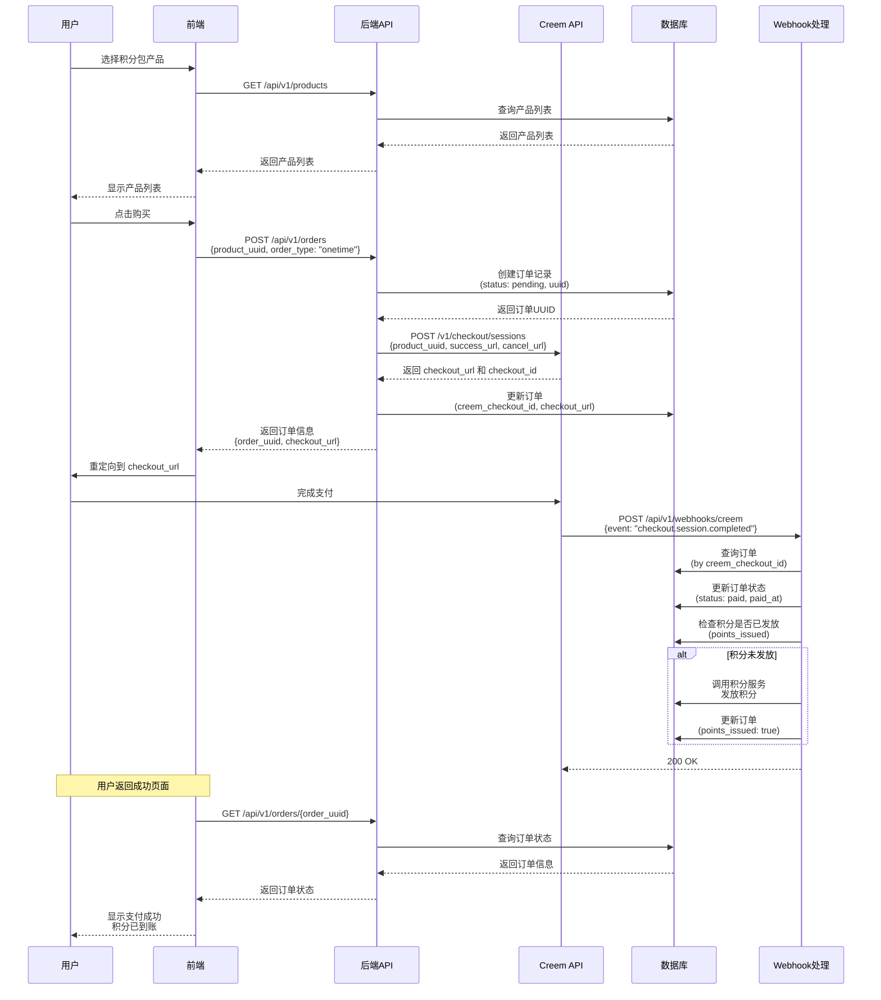
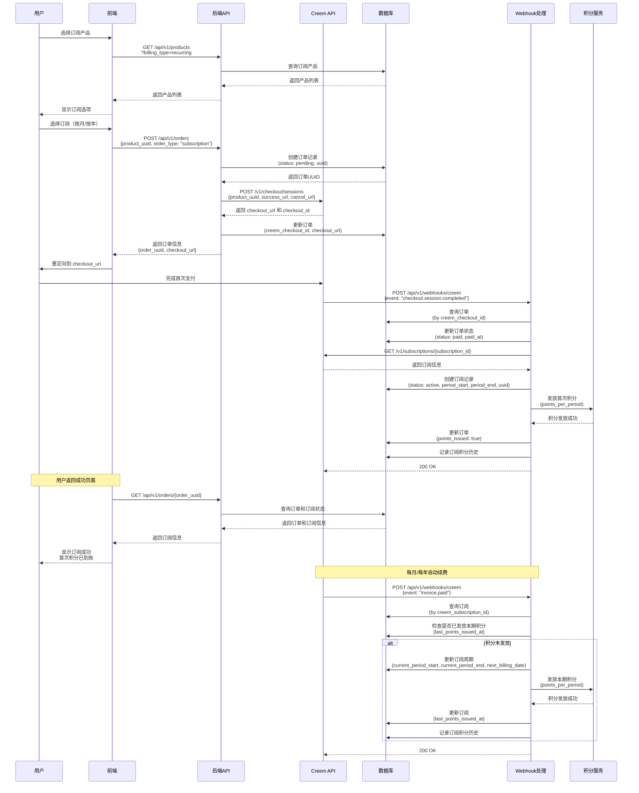
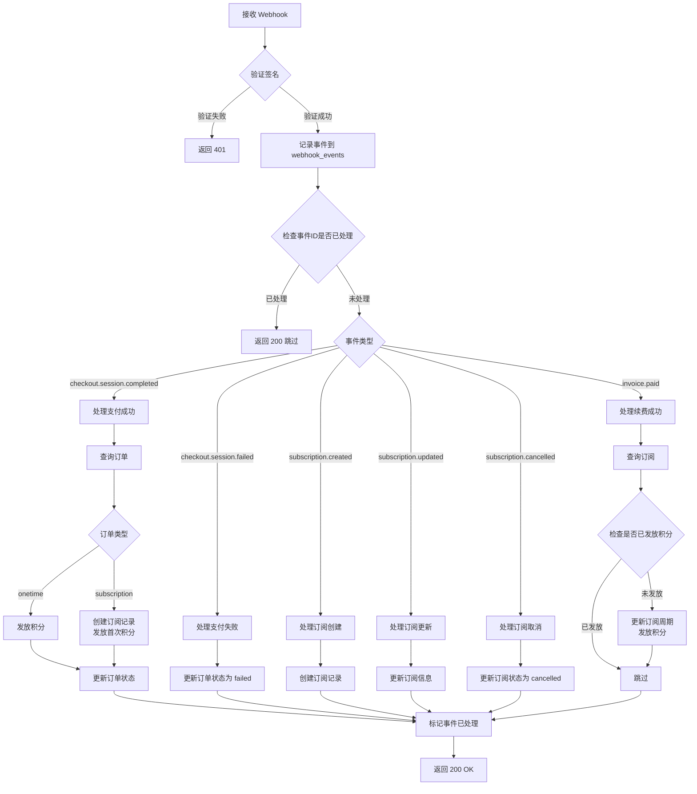
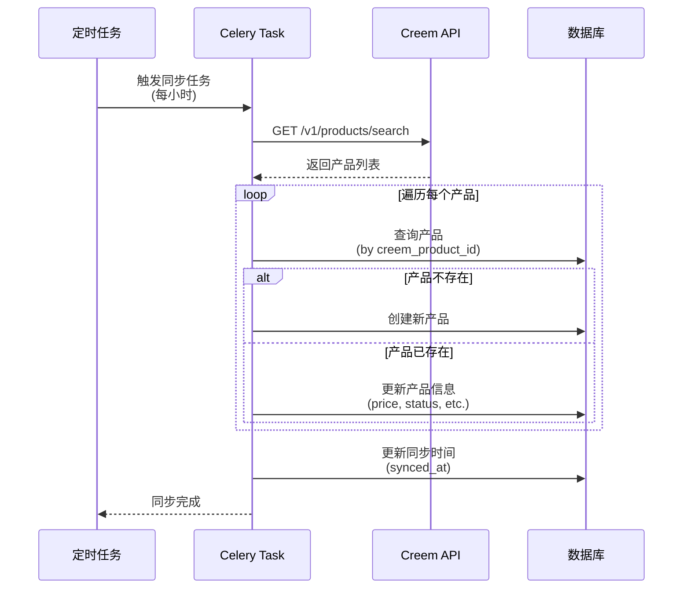

# Creem 支付系统设计方案

## 一、概述

本文档描述基于 Creem 支付服务的支付和订单管理系统设计方案。系统支持两种支付方式：
1. **一次性支付**：用户购买积分包
2. **订阅支付**：用户订阅会员（按月/按年），每月自动赠送积分

### 1.1 设计原则

- **支付处理**：所有支付流程通过 Creem 完成
- **数据同步**：产品信息通过 Creem API 同步到本地
- **订单记录**：本地后端记录所有订单和支付信息
- **Webhook 处理**：通过 Webhook 接收支付状态更新
- **积分发放**：支付成功后自动发放积分

### 1.2 技术栈

- **支付服务**：Creem API
- **后端框架**：FastAPI (Python)
- **前端框架**：Next.js (React)
- **数据库**：PostgreSQL
- **任务队列**：Celery (用于异步处理)

---

## 二、系统架构

```
┌─────────────────────────────────────────────────────────────────────────┐
│                         Creem 支付系统架构                                │
├─────────────────────────────────────────────────────────────────────────┤
│                                                                          │
│  前端 (Next.js)                   后端 (FastAPI)         Creem API        │
│  ────────────                    ────────────         ──────────         │
│                                                                          │
│  产品列表页面                                                             │
│      │                                                                   │
│      ├── 获取产品列表 ──────► GET /api/v1/products ────► Creem API      │
│      │                      (同步 Creem 产品)                            │
│      │                                                                   │
│  购买流程                                                                 │
│      │                                                                   │
│      ├── 创建订单 ──────► POST /api/v1/orders ──────► 创建本地订单       │
│      │                      (一次性/订阅)                                │
│      │                                                                   │
│      ├── 创建支付会话 ────► POST /api/v1/checkout ────► Creem API       │
│      │                      (返回 checkout_url)                          │
│      │                                                                   │
│      ├── 跳转支付 ──────► 重定向到 Creem Checkout                        │
│      │                                                                   │
│      ├── 支付成功回调 ────► 前端轮询或 WebSocket ────► 查询订单状态      │
│      │                                                                   │
│  Webhook 处理                                                           │
│      │                                                                   │
│      └── Creem Webhook ──► POST /api/v1/webhooks/creem ──► 处理事件    │
│                            (支付成功/失败/订阅更新)                      │
│                            ├── 更新订单状态                              │
│                            ├── 发放积分                                  │
│                            └── 处理订阅状态                              │
│                                                                          │
│  产品同步                                                                 │
│      │                                                                   │
│      └── 定时任务 ──────► Celery Task ──────► Creem API                  │
│          (每小时)            sync_products()                              │
│                              ├── 获取产品列表                             │
│                              ├── 同步到本地数据库                         │
│                              └── 更新产品状态                             │
│                                                                          │
└─────────────────────────────────────────────────────────────────────────┘
```

---

## 三、数据库设计

### 3.1 products（产品表）

存储从 Creem 同步的产品信息。

| 字段名 | 类型 | 约束 | 说明 |
|--------|------|------|------|
| `uuid` | UUID | UNIQUE, NOT NULL, DEFAULT gen_random_uuid(), INDEX | 产品公开 ID（对外暴露用） |
| `product_id` | INTEGER | PRIMARY KEY, INDEX | 产品ID（本地） |
| `creem_product_id` | VARCHAR(100) | UNIQUE, NOT NULL, INDEX | Creem 产品ID |
| `name` | VARCHAR(200) | NOT NULL | 产品名称 |
| `description` | TEXT | | 产品描述 |
| `price` | INTEGER | NOT NULL | 价格（分） |
| `currency` | VARCHAR(10) | NOT NULL, DEFAULT 'USD' | 货币代码 |
| `billing_type` | VARCHAR(20) | NOT NULL, INDEX | 计费类型：onetime（一次性）、recurring（订阅） |
| `billing_period` | VARCHAR(50) | | 计费周期：every-month（每月）、every-year（每年） |
| `points_amount` | INTEGER | NOT NULL | 赠送积分数量 |
| `status` | VARCHAR(20) | NOT NULL, INDEX | 状态：active（激活）、inactive（停用） |
| `image_url` | VARCHAR(500) | | 产品图片URL |
| `product_url` | VARCHAR(500) | | Creem 产品页面URL |
| `features` | JSON | | 产品特性（JSON数组） |
| `creem_mode` | VARCHAR(20) | | Creem 环境：test、prod |
| `created_at` | TIMESTAMP | DEFAULT NOW() | 创建时间 |
| `updated_at` | TIMESTAMP | ON UPDATE NOW() | 更新时间 |
| `synced_at` | TIMESTAMP | | 最后同步时间 |

**说明**：
- 产品信息通过 Creem API 同步
- `points_amount` 字段用于记录该产品对应的积分数量（需要在 Creem 产品描述或 metadata 中配置）

---

### 3.2 orders（订单表）

存储所有订单信息（包括一次性支付和订阅）。

| 字段名 | 类型 | 约束 | 说明 |
|--------|------|------|------|
| `uuid` | UUID | UNIQUE, NOT NULL, DEFAULT gen_random_uuid(), INDEX | 订单公开 ID（对外暴露用） |
| `order_id` | INTEGER | PRIMARY KEY, INDEX | 订单ID（本地） |
| `order_number` | VARCHAR(50) | UNIQUE, NOT NULL, INDEX | 订单号（唯一） |
| `user_id` | INTEGER | FOREIGN KEY → users.user_id, NOT NULL, INDEX | 用户ID |
| `product_id` | INTEGER | FOREIGN KEY → products.product_id, NOT NULL, INDEX | 产品ID |
| `creem_checkout_id` | VARCHAR(100) | UNIQUE, INDEX | Creem Checkout Session ID |
| `creem_transaction_id` | VARCHAR(100) | INDEX | Creem Transaction ID |
| `order_type` | VARCHAR(20) | NOT NULL, INDEX | 订单类型：onetime（一次性）、subscription（订阅） |
| `status` | VARCHAR(20) | NOT NULL, INDEX | 订单状态：pending（待支付）、paid（已支付）、failed（失败）、cancelled（取消）、refunded（退款） |
| `amount` | INTEGER | NOT NULL | 订单金额（分） |
| `currency` | VARCHAR(10) | NOT NULL, DEFAULT 'USD' | 货币代码 |
| `points_amount` | INTEGER | NOT NULL | 应发放积分数量 |
| `points_issued` | BOOLEAN | DEFAULT FALSE, INDEX | 积分是否已发放 |
| `checkout_url` | VARCHAR(500) | | Creem Checkout URL |
| `success_url` | VARCHAR(500) | | 支付成功回调URL |
| `cancel_url` | VARCHAR(500) | | 支付取消回调URL |
| `paid_at` | TIMESTAMP | | 支付时间 |
| `expires_at` | TIMESTAMP | | 订单过期时间 |
| `metadata` | JSON | | 扩展信息 |
| `created_at` | TIMESTAMP | DEFAULT NOW() | 创建时间 |
| `updated_at` | TIMESTAMP | ON UPDATE NOW() | 更新时间 |

**说明**：
- 订单号格式：`ORD{timestamp}{random}` 或使用 UUID
- `points_issued` 用于防止重复发放积分
- 订阅订单在首次支付成功后，后续续费通过 `subscriptions` 表管理

---

### 3.3 subscriptions（订阅表）

存储订阅信息（仅用于订阅类型的订单）。

| 字段名 | 类型 | 约束 | 说明 |
|--------|------|------|------|
| `uuid` | UUID | UNIQUE, NOT NULL, DEFAULT gen_random_uuid(), INDEX | 订阅公开 ID（对外暴露用） |
| `subscription_id` | INTEGER | PRIMARY KEY, INDEX | 订阅ID（本地） |
| `order_id` | INTEGER | FOREIGN KEY → orders.order_id, UNIQUE, NOT NULL, INDEX | 关联订单ID |
| `user_id` | INTEGER | FOREIGN KEY → users.user_id, NOT NULL, INDEX | 用户ID |
| `creem_subscription_id` | VARCHAR(100) | UNIQUE, NOT NULL, INDEX | Creem 订阅ID |
| `status` | VARCHAR(20) | NOT NULL, INDEX | 订阅状态：active（激活）、cancelled（取消）、expired（过期）、past_due（逾期） |
| `billing_period` | VARCHAR(50) | NOT NULL | 计费周期：every-month、every-year |
| `current_period_start` | TIMESTAMP | | 当前计费周期开始时间 |
| `current_period_end` | TIMESTAMP | | 当前计费周期结束时间 |
| `next_billing_date` | TIMESTAMP | | 下次计费时间 |
| `points_per_period` | INTEGER | NOT NULL | 每个周期赠送的积分 |
| `last_points_issued_at` | TIMESTAMP | | 上次发放积分时间 |
| `cancel_at_period_end` | BOOLEAN | DEFAULT FALSE | 是否在周期结束时取消 |
| `cancelled_at` | TIMESTAMP | | 取消时间 |
| `metadata` | JSON | | 扩展信息 |
| `created_at` | TIMESTAMP | DEFAULT NOW() | 创建时间 |
| `updated_at` | TIMESTAMP | ON UPDATE NOW() | 更新时间 |

**说明**：
- 订阅创建后，每月/每年自动续费
- 每个计费周期开始时，通过 Webhook 触发积分发放
- `last_points_issued_at` 用于防止重复发放积分

---

### 3.4 subscription_points_history（订阅积分发放记录表）

记录订阅每个周期发放的积分历史。

| 字段名 | 类型 | 约束 | 说明 |
|--------|------|------|------|
| `uuid` | UUID | UNIQUE, NOT NULL, DEFAULT gen_random_uuid(), INDEX | 记录公开 ID（对外暴露用） |
| `history_id` | INTEGER | PRIMARY KEY, INDEX | 记录ID |
| `subscription_id` | INTEGER | FOREIGN KEY → subscriptions.subscription_id, NOT NULL, INDEX | 订阅ID |
| `order_id` | INTEGER | FOREIGN KEY → orders.order_id, NOT NULL, INDEX | 关联订单ID |
| `user_id` | INTEGER | FOREIGN KEY → users.user_id, NOT NULL, INDEX | 用户ID |
| `points_record_id` | INTEGER | FOREIGN KEY → points_records.record_id, INDEX | 积分记录ID |
| `period_start` | TIMESTAMP | NOT NULL | 计费周期开始时间 |
| `period_end` | TIMESTAMP | NOT NULL | 计费周期结束时间 |
| `points_amount` | INTEGER | NOT NULL | 发放积分数量 |
| `issued_at` | TIMESTAMP | DEFAULT NOW() | 发放时间 |
| `creem_invoice_id` | VARCHAR(100) | INDEX | Creem 发票ID（如果有） |

**说明**：
- 用于追踪订阅积分的发放历史
- 防止重复发放（通过 `period_start` 和 `subscription_id` 唯一性检查）

---

### 3.5 webhook_events（Webhook 事件记录表）

记录所有接收到的 Webhook 事件，用于审计和调试。

| 字段名 | 类型 | 约束 | 说明 |
|--------|------|------|------|
| `uuid` | UUID | UNIQUE, NOT NULL, DEFAULT gen_random_uuid(), INDEX | 事件公开 ID（对外暴露用） |
| `event_id` | INTEGER | PRIMARY KEY, INDEX | 事件ID |
| `event_type` | VARCHAR(50) | NOT NULL, INDEX | 事件类型 |
| `creem_event_id` | VARCHAR(100) | UNIQUE, INDEX | Creem 事件ID |
| `payload` | JSON | NOT NULL | 事件数据（完整 payload） |
| `processed` | BOOLEAN | DEFAULT FALSE, INDEX | 是否已处理 |
| `processed_at` | TIMESTAMP | | 处理时间 |
| `error_message` | TEXT | | 处理错误信息 |
| `created_at` | TIMESTAMP | DEFAULT NOW() | 接收时间 |

**说明**：
- 记录所有 Webhook 事件，便于排查问题
- 通过 `creem_event_id` 防止重复处理

---

## 四、API 设计

### 4.1 产品相关 API

#### 4.1.1 获取产品列表

```http
GET /api/v1/products
```

**查询参数**：
- `billing_type` (可选): `onetime` 或 `recurring`，筛选计费类型
- `status` (可选): `active` 或 `inactive`，筛选状态
- `page` (可选): 页码，默认 1
- `page_size` (可选): 每页数量，默认 20

**响应**：
```json
{
  "items": [
    {
      "uuid": "8b8f6e6e-8f7f-4f2d-9e4c-1a2b3c4d5e6f",
      "product_id": 1,
      "creem_product_id": "prod_xxx",
      "name": "100积分包",
      "description": "一次性购买100积分",
      "price": 1000,
      "currency": "USD",
      "billing_type": "onetime",
      "points_amount": 100,
      "status": "active",
      "image_url": "https://...",
      "product_url": "https://creem.io/product/..."
    }
  ],
  "pagination": {
    "total": 10,
    "page": 1,
    "page_size": 20,
    "total_pages": 1
  }
}
```

#### 4.1.2 同步产品（管理员）

```http
POST /api/v1/products/sync
```

**说明**：从 Creem API 同步产品到本地数据库

**响应**：
```json
{
  "synced_count": 5,
  "updated_count": 3,
  "created_count": 2
}
```

---

### 4.2 订单相关 API

#### 4.2.1 创建订单

```http
POST /api/v1/orders
```

**请求体**：
```json
{
  "product_uuid": "8b8f6e6e-8f7f-4f2d-9e4c-1a2b3c4d5e6f",
  "order_type": "onetime",  // 或 "subscription"
  "success_url": "https://example.com/success",
  "cancel_url": "https://example.com/cancel"
}
```

**响应**：
```json
{
  "uuid": "f1a2b3c4-d5e6-7890-1234-abcdefabcdef",
  "order_id": 123,
  "order_number": "ORD20250101123456",
  "status": "pending",
  "checkout_url": "https://creem.io/checkout/xxx",
  "expires_at": "2025-01-01T12:30:00Z"
}
```

**流程**：
1. 创建本地订单记录（状态：pending）
2. 调用 Creem API 创建 Checkout Session
3. 更新订单的 `creem_checkout_id` 和 `checkout_url`
4. 返回订单信息和支付链接

#### 4.2.2 查询订单

```http
GET /api/v1/orders/{order_uuid}
```

**响应**：
```json
{
  "uuid": "f1a2b3c4-d5e6-7890-1234-abcdefabcdef",
  "order_id": 123,
  "order_number": "ORD20250101123456",
  "status": "paid",
  "amount": 1000,
  "currency": "USD",
  "points_amount": 100,
  "points_issued": true,
  "paid_at": "2025-01-01T12:25:00Z",
  "product": {
    "name": "100积分包",
    "billing_type": "onetime"
  }
}
```

#### 4.2.3 查询用户订单列表

```http
GET /api/v1/orders
```

**查询参数**：
- `status` (可选): 筛选订单状态
- `order_type` (可选): 筛选订单类型
- `page` (可选): 页码
- `page_size` (可选): 每页数量

**说明**：对外 API 统一使用 `uuid` 作为资源标识；`id` 仅用于内部持久化与审计。

---

### 4.3 订阅相关 API

#### 4.3.1 查询用户订阅

```http
GET /api/v1/subscriptions
```

**响应**：
```json
{
  "items": [
    {
      "uuid": "9c8b7a6d-5e4f-3c2b-1a0f-edcba9876543",
      "subscription_id": 1,
      "status": "active",
      "billing_period": "every-month",
      "current_period_start": "2025-01-01T00:00:00Z",
      "current_period_end": "2025-02-01T00:00:00Z",
      "next_billing_date": "2025-02-01T00:00:00Z",
      "points_per_period": 200,
      "product": {
        "name": "月度会员",
        "price": 2000
      }
    }
  ]
}
```

#### 4.3.2 取消订阅

```http
POST /api/v1/subscriptions/{subscription_uuid}/cancel
```

**请求体**（可选）：
```json
{
  "cancel_at_period_end": true  // 是否在周期结束时取消
}
```

**响应**：
```json
{
  "uuid": "9c8b7a6d-5e4f-3c2b-1a0f-edcba9876543",
  "subscription_id": 1,
  "status": "cancelled",
  "cancel_at_period_end": true,
  "cancelled_at": "2025-01-15T10:00:00Z"
}
```

**流程**：
1. 调用 Creem API 取消订阅
2. 更新本地订阅状态
3. 如果 `cancel_at_period_end=true`，订阅在周期结束时才真正取消

---

### 4.4 Webhook API

#### 4.4.1 Creem Webhook 接收

```http
POST /api/v1/webhooks/creem
```

**说明**：
- 接收 Creem 发送的 Webhook 事件
- 验证签名（如果 Creem 支持）
- 异步处理事件，避免超时

**支持的事件类型**：
- `checkout.session.completed`: 支付成功
- `checkout.session.failed`: 支付失败
- `subscription.created`: 订阅创建
- `subscription.updated`: 订阅更新
- `subscription.cancelled`: 订阅取消
- `invoice.paid`: 发票支付成功（订阅续费）

---

## 五、支付流程设计

### 5.1 一次性支付流程（购买积分）



### 5.2 订阅支付流程（按月/按年订阅）



---

## 六、Webhook 事件处理

### 6.1 支持的事件类型

| 事件类型 | 说明 | 处理逻辑 |
|---------|------|---------|
| `checkout.session.completed` | 支付成功 | 1. 更新订单状态为 `paid`<br/>2. 如果是订阅，创建订阅记录<br/>3. 发放积分 |
| `checkout.session.failed` | 支付失败 | 更新订单状态为 `failed` |
| `checkout.completed` | 支付成功（别名） | 同 `checkout.session.completed` |
| `subscription.created` | 订阅创建 | 创建订阅记录（如果订单中未创建） |
| `subscription.updated` / `subscription.update` | 订阅更新 | 更新订阅信息（周期、状态等） |
| `subscription.active` / `subscription.trialing` / `subscription.paused` / `subscription.past_due` / `subscription.unpaid` / `subscription.expired` | 订阅状态变化 | 更新订阅状态；如有周期信息可同步周期字段 |
| `subscription.cancelled` / `subscription.canceled` | 订阅取消 | 更新订阅状态为 `cancelled` |
| `subscription.scheduled_cancel` | 到期取消 | 设置 `cancel_at_period_end=true` |
| `subscription.paid` | 订阅扣款成功 | 视同续费支付成功（若含周期信息可发当期积分；否则仅更新状态） |
| `invoice.paid` | 发票/续费支付成功 | 1. 更新订阅周期<br/>2. 发放本期积分 |
| `refund.created` | 创建退款 | 当前仅记录事件（可扩展退款对账） |
| `dispute.created` | 发起争议 | 当前仅记录事件（可扩展争议处理） |

### 6.2 Webhook 处理流程



---

## 附加：订阅周期积分发放（按月/按年，统一“按月发放”）

### 设计目标
- 无论按月付费还是按年付费，均按“月度发放”。
  - 按月付费：支付当期立即发放当月积分；次月在购买日自动发放。
  - 按年付费：首付后当月发放，当后续每个“购买日当月”自动发放一次（共 12 次），不一次性预发全年积分。
- 依赖 Creem 续费事件（`invoice.paid` 为主）确定周期；也可在无事件时按“购买日”调度兜底。
- 幂等发放，防止重复积分。

### 触发与幂等
- 触发事件：`invoice.paid`（优先），或 `subscription.updated` 含新周期信息。
- 若年付无月度续费事件，由 Celery 定时任务在“购买日当月”兜底触发发放。
- 幂等键：`subscription_id + period_start`（`subscription_points_history` 记录），重复事件自动跳过。

### 发放流程
1) 事件或调度触发，确定本期周期起止：对于年付，周期长度按月（基于购买日）；对于月付，按账单周期或事件提供的 period。
2) 查订阅（`creem_subscription_id`）；不存在则告警。
3) 幂等检查：`subscription_id + period_start` 已存在则跳过。
4) 发放积分：本期积分 = `subscription.points_per_period`（订阅创建时写入，通常等于产品配置的月度积分）。写积分记录（record_type=`recharge`，operation_type=`creem_subscription`）。
5) 写 `subscription_points_history`：subscription_id, order_id, user_id, points_record_id, period_start, period_end, points_amount, creem_invoice_id。
6) 更新订阅：`current_period_start`、`current_period_end`、`next_billing_date`、`last_points_issued_at`（对于年付，next_billing_date 仍为下一年度续费日，但月度发放依赖事件或兜底调度）。

### 对账与监控
- 事件表：`webhook_events` 记录续费事件，`creem_event_id` 去重。
- 历史表：`subscription_points_history` 可按月/年对账（期数 × 每期积分 ≈ 发放总量）。
- 告警：找不到订阅 / 幂等冲突 / 发放失败。

### 边界场景
- 补发：漏发按 period_start 手动补发，写 history。
- 时区：period_start/end 以 UTC 存储，展示时转换。
- 停用：取消/过期后不再发放；若当期发票已支付仍发当期积分。
- 年付无事件兜底：在“购买日当月”的定时任务按订阅创建日生成当月的 period_start/period_end 并发放（仍用幂等键防重复）。

### 后端落地要点（待开发/补充）
- Webhook `invoice.paid` / `subscription.updated` 分支中落地上述发放与幂等逻辑。
- `SubscriptionService.issue_cycle_points` 已有幂等能力，可复用 period_start 作为键。
- 确保订阅创建时写入 `points_per_period`（源自产品同步的 `points_amount`）。

---

## 容错与轮询补偿（无 Webhook 也能确认支付/续费）

### 目标
- 无论是否收到 Webhook，都能确认一次性订单支付状态、订阅续费状态，并完成积分发放。
- 轮询窗口：创建/计费后 3 分钟开始，退避轮询，不超过 24 小时。

### 一次性订单轮询
- 触发条件：订单 `status=pending` 且创建时间 ≥ 3 分钟，未超过 24 小时。
- 数据源：Creem 交易查询 [`GET /v1/transactions/search`](https://docs.creem.io/api-reference/endpoint/get-transactions)，按 `order_id`（可使用 `creem_checkout_id`）过滤。
- 轮询节奏：退避（示例）3m/6m/12m/24m/48m/96m/4h/8h/16h（总计不超 24h）。实现上可用固定 5~10 分钟间隔 + 时间窗过滤。
- 命中逻辑：若查询到交易 `status=paid`，则标记订单 `paid` 并发放积分（幂等：`points_issued` 或事件表去重）。若超 24h 仍未支付且无 Webhook，则标记 `expired/failed` 并停止轮询。
- 审计：将轮询命中写入事件表，`source=polling`，避免与 Webhook 重复。

### 订阅续费轮询（按月发放，年付也月发放）
- 触发条件：订阅计费日（锚定购买日的当月日号），且当期积分未发放；在计费日起 24h 内未收到续费 Webhook。
- 数据源：Creem 交易查询 [`GET /v1/transactions/search`](https://docs.creem.io/api-reference/endpoint/get-transactions)，按 `subscription` 过滤，近 24h 交易中如有 `status=paid`/`type=invoice` 视为当期续费成功。
- 轮询节奏：与订单类似的退避或固定间隔（如每 10 分钟），窗口不超过 24h。
- 命中逻辑：更新订阅周期字段（period_start/end、next_billing_date），调用 `issue_cycle_points` 发放当期积分（幂等键 `subscription_id + period_start`），记录 history 与事件表（source=polling）。
- 未命中：超过 24h 未支付可标记 `past_due` 或保留原状态并告警，等待人工/下一周期。

### 幂等与对账
- 幂等键：订单发放用 `order_uuid + points_issued`；订阅发放用 `subscription_id + period_start`（history）。
- 事件表：Webhook 与轮询统一写入 `webhook_events`，带 `source` 字段（webhook/polling），防重复、便对账。
- 对账：周期性对账 Creem 交易/发票与本地订单/订阅发放记录，差异项触发补偿或人工。

### 后端实现要点（需开发）
- Creem Client 增加交易查询封装，支持按 order_id/subscription 过滤。
- Celery 定时任务：
  - `poll_pending_orders`：筛选 pending 且 3 分钟~24 小时内的订单，调用交易查询并更新状态/发放。
  - `poll_subscriptions_billing`：在计费日窗口内、当期未发放的订阅，调用交易查询并发放。
- 轮询间隔可固定（5~10 分钟）+ 窗口过滤，简化退避实现；或在任务内部按“上次轮询时间”控制。

## 七、产品同步机制

### 7.1 同步策略

- **定时同步**：每小时通过 Celery 任务同步一次
- **手动同步**：管理员可通过 API 手动触发同步
- **增量更新**：只更新有变化的产品

### 7.2 同步流程



### 7.3 产品配置说明

在 Creem 中创建产品时，需要在产品描述或 metadata 中配置积分数量。建议格式：

**方式1：在描述中标注**
```
产品描述：100积分包 - 一次性购买100积分，可用于创作、生成等操作。
```

**方式2：使用 metadata（如果 Creem 支持）**
```json
{
  "points_amount": 100,
  "product_type": "points_package"
}
```

后端同步时，从描述中解析或从 metadata 中读取积分数量。

---

## 八、前端集成方案

### 8.1 产品展示页面

```typescript
// 获取产品列表
const { data: products } = useQuery({
  queryKey: ['products', { billing_type: 'onetime' }],
  queryFn: () => productsApi.getProducts({ billing_type: 'onetime' })
})

// 渲染产品卡片
{products?.items.map(product => (
  <ProductCard
    key={product.product_id}
    name={product.name}
    price={product.price}
    points={product.points_amount}
    onPurchase={() => handlePurchase(product)}
  />
))}
```

### 8.2 创建订单和支付

```typescript
const handlePurchase = async (product: Product) => {
  // 创建订单
  const order = await ordersApi.createOrder({
    product_id: product.product_id,
    order_type: product.billing_type === 'onetime' ? 'onetime' : 'subscription',
    success_url: `${window.location.origin}/${locale}/payment/success`,
    cancel_url: `${window.location.origin}/${locale}/payment/cancel`
  })
  
  // 跳转到 Creem Checkout
  window.location.href = order.checkout_url
}
```

### 8.3 支付成功页面

```typescript
// 支付成功页面
const PaymentSuccessPage = () => {
  const searchParams = useSearchParams()
  const orderId = searchParams.get('order_id')
  
  // 轮询订单状态
  const { data: order } = useQuery({
    queryKey: ['order', orderId],
    queryFn: () => ordersApi.getOrder(orderId!),
    enabled: !!orderId,
    refetchInterval: (data) => {
      // 如果订单已支付，停止轮询
      return data?.status === 'paid' ? false : 2000
    }
  })
  
  if (order?.status === 'paid') {
    return <SuccessMessage points={order.points_amount} />
  }
  
  return <LoadingMessage />
}
```

### 8.4 订阅管理页面

```typescript
// 查询用户订阅
const { data: subscriptions } = useQuery({
  queryKey: ['subscriptions'],
  queryFn: () => subscriptionsApi.getSubscriptions()
})

// 取消订阅
const cancelSubscription = async (subscriptionId: number) => {
  await subscriptionsApi.cancelSubscription(subscriptionId, {
    cancel_at_period_end: true
  })
  // 刷新订阅列表
  queryClient.invalidateQueries({ queryKey: ['subscriptions'] })
}
```

---

## 九、安全考虑

### 9.1 Webhook 验证

- **签名验证**：如果 Creem 支持，验证 Webhook 签名
- **事件去重**：通过 `creem_event_id` 防止重复处理
- **幂等性**：确保相同事件多次处理结果一致

### 9.2 订单安全

- **订单过期**：设置订单过期时间（如 30 分钟）
- **状态校验**：支付前检查订单状态
- **用户校验**：确保用户只能查看自己的订单

### 9.3 积分发放安全

- **防重复发放**：通过 `points_issued` 标志防止重复发放
- **事务处理**：积分发放使用数据库事务
- **日志记录**：记录所有积分发放操作

---

## 十、错误处理

### 10.1 支付失败处理

- **订单状态更新**：Webhook 接收到失败事件时更新订单状态
- **用户通知**：前端显示支付失败提示
- **重试机制**：允许用户重新创建订单

### 10.2 Webhook 处理失败

- **重试机制**：Creem 可能会重试失败的 Webhook
- **错误记录**：记录处理失败的事件到 `webhook_events` 表
- **手动处理**：提供管理员接口手动处理失败的事件

### 10.3 积分发放失败

- **补偿机制**：提供手动发放积分的接口
- **日志追踪**：记录所有积分发放操作
- **对账功能**：定期对账订单和积分记录

---

## 十一、配置说明

---

## 附加：退款机制设计

### 退款策略
- 支持部分退款，按“可扣回积分 / 已发放积分”比例计算退款金额。
- 可扣回积分 = min(当前可用积分, 订单已发放积分)；若已发放为 0 则视为全额可退。
- 默认低于可退比例阈值（如 20%）拒绝退款，可通过管理员强制退款。
- 一次性订单：扣回积分后按比例退款；订阅订单：扣回积分并立即取消订阅（或按需设置期末取消）。
- 若积分不足则只扣剩余积分并按比例部分退款，不允许负积分（可扩展为允许透支并设置上限）。

### 计算公式
- refund_ratio = can_deduct_points / issued_points  （issued_points=订单积分数；若 0 则 ratio=1）
- refund_amount = order_amount * refund_ratio
- refunded_points = can_deduct_points

### 流程（管理员）
1) 校验订单状态可退款（paid）；校验可退比例阈值（可 force 跳过）。
2) 计算可扣积分、比例与退款金额。
3) 扣回积分：写负向积分记录（record_type=refund, operation_type=creem_refund，extra_data 记录 order_uuid、ratio）。
4) 若为订阅：调用取消订阅（默认立即取消，可配置期末取消）。
5) 更新订单状态为 refunded，记录 refund_amount/refunded_points/refund_ratio/refund_reason。
6)（可选）调用 Creem 退款 API（若后续开放）。当前方案默认线下/后台处理实际退款。

### 风控/防白嫖
- 可退比例阈值（如 <20% 自动拒绝或转人工）。
- 频次与额度限制：同一用户每日/每月退款次数与金额上限（可选）。
- 审计与幂等：订单状态 + refund 字段/事件表防重复；保留退款流水。

### API
- 管理员退款：`POST /api/v1/orders/{order_uuid}/refund`
  - 请求体：`{ refund_reason?: string, force?: boolean }`
  - 响应：`{ refund_amount, refunded_points, refund_ratio, status }`
  - 权限：管理员（占位字段 `is_admin`，需结合实际鉴权实现）

### 字段与记录
- 订单：在 metadata 写入 `refund_amount`、`refunded_points`、`refund_ratio`、`refund_reason`（如需持久字段，可在后续迁移中补充专用列）。
- 积分记录：负向记录记入 `points_records`，operation_type=`creem_refund`。

### 订阅特化
- 本期发放积分=points_per_period；可退比例按本期可扣积分计算；退款同时取消订阅。
- 续费/跨期退款需按 Creem 规则拆分期次（后续如有需要再扩展）。

### 11.1 环境变量

```bash
# Creem API 配置
CREEM_API_KEY=your_api_key
CREEM_API_URL=https://api.creem.io  # 或 https://test-api.creem.io
CREEM_WEBHOOK_SECRET=your_webhook_secret  # 如果支持签名验证

# Webhook 配置
WEBHOOK_BASE_URL=https://your-domain.com  # Webhook 接收地址
```

### 11.2 Creem 产品配置建议

**一次性支付产品（积分包）**：
- 产品名称：如 "100积分包"、"500积分包"
- 计费类型：`onetime`
- 价格：根据积分数量设置
- 描述：包含积分数量信息

**订阅产品（会员）**：
- 产品名称：如 "月度会员"、"年度会员"
- 计费类型：`recurring`
- 计费周期：`every-month` 或 `every-year`
- 价格：按月/年设置
- 描述：包含每月赠送积分信息

---

## 十二、测试方案

### 12.1 单元测试

- 订单创建逻辑
- Webhook 事件处理
- 积分发放逻辑
- 订阅周期计算

### 12.2 集成测试

- 完整支付流程（使用 Creem 测试环境）
- Webhook 接收和处理
- 产品同步

### 12.3 测试环境

- 使用 Creem 测试 API：`https://test-api.creem.io`
- 使用测试 API Key
- 模拟 Webhook 事件

---

## 十三、部署清单

### 13.1 后端部署

- [ ] 配置 Creem API Key
- [ ] 配置 Webhook URL（在 Creem 后台设置）
- [ ] 运行数据库迁移（创建新表）
- [ ] 配置 Celery 定时任务（产品同步）
- [ ] 测试 Webhook 接收

### 13.2 前端部署

- [ ] 配置支付成功/取消回调 URL
- [ ] 测试支付流程
- [ ] 测试订阅管理

### 13.3 Creem 后台配置

- [ ] 创建产品（一次性支付和订阅）
- [ ] 配置 Webhook URL
- [ ] 测试 Webhook 发送

---

## 十四、后续优化

### 14.1 功能增强

- **优惠券系统**：集成 Creem 折扣码功能
- **发票管理**：记录和管理发票信息
- **退款处理**：处理退款和积分回收
- **订阅升级/降级**：支持订阅计划变更

### 14.2 性能优化

- **缓存产品列表**：减少数据库查询
- **异步处理**：Webhook 处理使用 Celery 异步任务
- **批量同步**：优化产品同步性能

### 14.3 监控和告警

- **支付成功率监控**：监控支付成功/失败率
- **Webhook 处理监控**：监控 Webhook 处理延迟和失败
- **积分发放监控**：监控积分发放是否及时

---

## 附录：相关文档链接

- [Creem 快速开始](https://docs.creem.io/getting-started/quickstart)
- [Creem 一次性支付](https://docs.creem.io/features/one-time-payment)
- [Creem 订阅支付](https://docs.creem.io/features/subscriptions/introduction)
- [Creem Webhooks](https://docs.creem.io/code/webhooks)
- [Creem API 参考](https://docs.creem.io/api-reference/endpoint/search-products)

