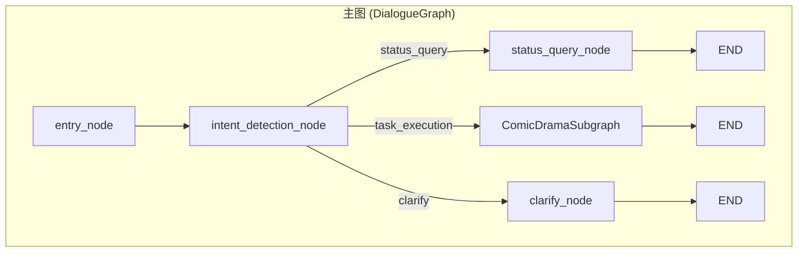
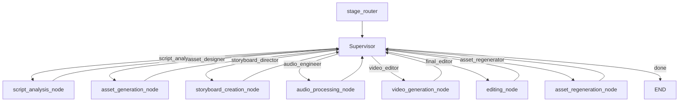
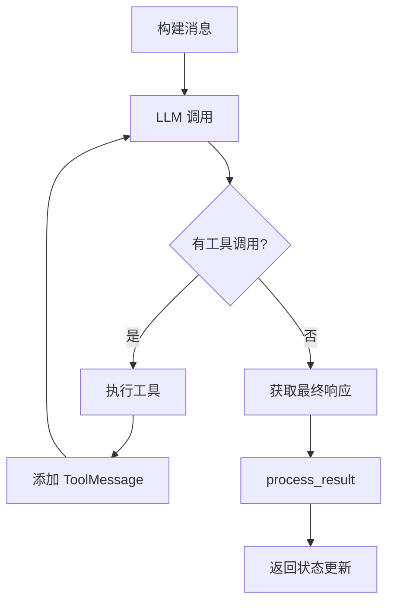

# AI Manju Agent 架构文档

本文档基于 `app/agent` 目录的实现，整理了完整的架构设计，包括主图、子图、Worker 调度机制以及 Tool 调用方式。

---

## 1. 整体架构概览

系统采用 **双层 LangGraph 架构**：



| 层级 | 职责 | 入口文件 |
|------|------|----------|
| **主图 (DialogueGraph)** | 对话管理、意图识别、路由分发 | `dialogue_graph.py` |
| **子图 (ComicDramaSubgraph)** | 漫剧生产业务执行 | `comic_drama_subgraph.py` |

---

## 2. 主图 (DialogueGraph)

### 2.1 节点结构

```
entry → intent_detection → [status_query | task_execution | clarify] → END
```

| 节点 | 文件路径 | 职责 |
|------|----------|------|
| `entry_node` | `nodes/entry.py` | 初始化会话状态 |
| `intent_detection_node` | `nodes/intent_detection.py` | 意图识别与分类 |
| `router_node` | `nodes/router.py` | 路由决策 |
| `status_query_node` | `nodes/status_query.py` | 状态查询（ReAct 模式） |
| `clarify_node` | `nodes/clarify.py` | 澄清对话 |

### 2.2 意图分类

| 意图类型 | 目标节点 | 说明 |
|----------|----------|------|
| **Informational** | `status_query` | 数据库查询、知识检索 |
| **Productive** | `task_execution` | 委托给 ComicDramaSubgraph |
| **Conversational** | `clarify` | 模糊请求澄清 |

---

## 3. 子图 (ComicDramaSubgraph)

### 3.1 Supervisor-Worker 星型拓扑



### 3.2 节点职责表

| Worker 名称 | 节点函数 | 实现类 | 职责 |
|-------------|----------|--------|------|
| `script_analyst` | `script_analysis_node` | `ScriptAnalystNode` | 剧本分析 → 提取角色、场景 |
| `asset_designer` | `asset_generation_node` | `AssetGenerationWorkerNode` | 生成角色/场景/分镜图片（ReAct） |
| `storyboard_director` | `storyboard_creation_node` | `StoryboardDirectorNode` | 分镜脚本生成 |
| `audio_engineer` | `audio_processing_node` | `AudioEngineerNode` | 音频合成 |
| `video_editor` | `video_generation_node` | `VideoEditorNode` | 视频生成 |
| `final_editor` | `editing_node` | `FinalEditorNode` | 最终剪辑合成 |
| `asset_regenerator` | `asset_regeneration_node` | `AssetRegeneratorWorkerNode` | 资产重新生成（ReAct） |

### 3.3 生产流程

```
1. script_analyst（剧本分析）
   ↓
2. asset_designer（生成角色+场景 提示词+图片）
   ↓ [HITL 暂停确认]
3. storyboard_director（解析分镜脚本）
   ↓
4. asset_designer（生成分镜提示词+图片）
   ↓ [HITL 暂停确认]
5. video_editor（生成分镜视频）
   ↓ [HITL 暂停确认]
6. audio_engineer（音频处理）
   ↓
7. final_editor（最终合成）
```

---

## 4. Supervisor 调度机制

### 4.1 核心逻辑

Supervisor 位于 [`nodes/teams/supervisor.py`](file:///Users/moji/ground/mira-service/app/agent/graph/nodes/teams/supervisor.py)，采用 **工具强制调用模式**：

```python
# 强制使用 supervisor_decision 工具返回决策
tool_choice={"type": "function", "function": {"name": "supervisor_decision"}}
```

### 4.2 Supervisor 专用工具

| 工具名称 | 功能 | 参数 |
|----------|------|------|
| `query_production_status` | 查询生产状态缓存 | `creation_uuid` |
| `route_to_worker` | 调度任务到指定 Worker | `worker`, `task`, `creation_uuid` |
| `request_user_confirmation` | 请求用户确认 | `message`, `options` |
| `supervisor_decision` | 返回智能决策结果 | `next_worker`, `needs_input`, `board_actions`, `response_text`, `task_params` |

### 4.3 决策输出结构 (supervisor_decision)

```python
{
    "next_worker": "asset_designer" | "storyboard_director" | ... | None,
    "needs_input": True | False,
    "board_actions": [
        {"type": "switch_view", "target": "characters"},
        {"type": "approve_reject", "message": "请确认"}
    ],
    "response_text": "给用户的消息",
    "task_params": "{\"tasks\": [...], \"user_intent\": \"...\"}"
}
```

### 4.4 Board Actions 类型

| 类型 | 用途 | 示例 |
|------|------|------|
| `switch_view` | 前端切换视图 | 切换到角色/场景/分镜视图 |
| `refresh` | 刷新数据 | 刷新当前视图 |
| `approve_reject` | 请求用户确认 | HITL 审核点 |
| `text_input` | 请求文本输入 | 用户提供修改意见 |
| `select_options` | 选项选择 | 多选项确认 |

---

## 5. ReActWorkerNode 基类

### 5.1 设计理念

位于 [`nodes/teams/react_worker_base.py`](file:///Users/moji/ground/mira-service/app/agent/graph/nodes/teams/react_worker_base.py)，提供统一的 ReAct 循环框架。

### 5.2 抽象方法

```python
class ReActWorkerNode(ABC):
    # 是否使用 ReAct 模式
    USE_REACT = True
    
    @abstractmethod
    def get_system_prompt(self, state: ComicDramaState) -> str:
        """获取系统提示词"""
        pass
    
    @abstractmethod
    def get_tools(self) -> List:
        """获取可用工具列表"""
        pass
    
    @abstractmethod
    async def process_result(self, state, final_response, tool_results) -> Dict:
        """处理最终结果"""
        pass
```

### 5.3 ReAct 执行流程



---

## 6. Worker 实现详解

### 6.1 ScriptAnalystNode（剧本分析）

**文件**: [`script_analyst.py`](file:///Users/moji/ground/mira-service/app/agent/graph/nodes/teams/script_analyst.py)

**职责**:
- 调用 LLM 解析剧本，提取角色和场景
- 调用 `save_characters`、`save_scenes` 工具持久化

**调用的 Tools**:
- `save_characters` - 保存角色信息
- `save_scenes` - 保存场景信息

---

### 6.2 AssetGenerationWorkerNode（资产生成）

**文件**: [`asset_generation_worker.py`](file:///Users/moji/ground/mira-service/app/agent/graph/nodes/teams/asset_generation_worker.py)

**职责**:
- 分析 Supervisor 传递的任务参数
- 生成提示词或触发图片/视频生成任务

**调用的 Tools** (复用 regenerate_worker_tools):
- `query_characters` / `query_scenes` / `query_shots` - 查询资源
- `save_character_prompt` / `save_scene_prompt` - 保存提示词
- `submit_character_image` / `submit_scene_image` - 提交图片生成
- `submit_shot_images` / `submit_shot_videos` - 批量分镜生成

**任务参数格式**:
```python
task_params = {
    "tasks": [
        {"target_type": "character", "actions": ["prompt", "image"], "scope": "all"},
        {"target_type": "shot", "actions": ["prompt", "image"], "frame_type": "both"}
    ],
    "user_intent": "生成所有角色和场景图片"
}
```

---

### 6.3 StoryboardDirectorNode（分镜导演）

**文件**: [`storyboard_director.py`](file:///Users/moji/ground/mira-service/app/agent/graph/nodes/teams/storyboard_director.py)

**职责**:
- LLM 生成分镜脚本（描述、旁白、时长）
- 调用 `save_shots` 工具保存分镜数据
- **不负责**图片提示词和图片生成（由 `asset_generation_worker` 处理）

**调用的 Tools**:
- `save_shots` - 批量保存分镜信息

---

### 6.4 AudioEngineerNode（音频工程师）

**文件**: [`audio_engineer.py`](file:///Users/moji/ground/mira-service/app/agent/graph/nodes/teams/audio_engineer.py)

**职责**:
- 旁白音频合成
- 背景音乐处理
- 音效处理

**调用的 Tools**:
- `generate_audio` - 生成单个音频
- Audio-related batch tools

---

### 6.5 VideoEditorNode（视频编辑）

**文件**: [`video_editor.py`](file:///Users/moji/ground/mira-service/app/agent/graph/nodes/teams/video_editor.py)

**职责**:
- 分镜视频生成
- 视频转场处理

**调用的 Tools**:
- `generate_shot_videos` - 批量生成分镜视频
- `check_task_group_status` - 轮询任务状态

---

### 6.6 AssetRegeneratorWorkerNode（资产重新生成）

**文件**: [`asset_regenerator_worker.py`](file:///Users/moji/ground/mira-service/app/agent/graph/nodes/teams/asset_regenerator_worker.py)

**职责**:
- 处理用户"重新生成"、"修改"请求
- 支持角色/场景/分镜的提示词和图片重新生成

**调用的 Tools** (定义于 `regenerate_worker_tools.py`):
- 查询: `query_single_character`, `query_single_scene`, `query_single_shot`
- 保存提示词: `save_character_prompt`, `save_scene_prompt`, `save_shot_image_prompt`
- 提交生成: `submit_character_image`, `submit_scene_image`, `submit_shot_start_image`, `submit_shot_end_image`

---

## 7. Tools 分类与调用方式

### 7.1 工具分类体系

```
app/agent/tools/
├── db_tools.py              # 数据库查询与更新（Reasoning Tools）
├── agent_generation_tools.py # 生成类工具（Action Tools）
├── regenerate_worker_tools.py # 重新生成专用工具
├── context_tools.py         # 上下文工具
├── knowledge_tools.py       # 知识检索工具
├── audio_tools.py           # 音频相关工具
└── ...
```

### 7.2 Reasoning Tools（推理工具）

位于 `db_tools.py`，负责状态检索和原子级持久化：

| 工具名称 | 功能 |
|----------|------|
| `query_characters` | 查询角色列表 |
| `query_scenes` | 查询场景列表 |
| `query_shots` | 查询分镜列表 |
| `query_creation_status` | 查询创作整体状态 |
| `query_single_character/scene/shot` | 查询单个资源详情 |
| `save_characters` / `save_scenes` | 批量保存 |
| `update_character` / `update_scene` / `update_shot` | 更新资源 |

### 7.3 Action Tools（执行工具）

位于 `agent_generation_tools.py`，负责 Celery 任务派发：

| 工具名称 | 功能 |
|----------|------|
| `generate_character_image` | 生成单个角色图片 |
| `generate_scene_image` | 生成单个场景图片 |
| `generate_video` | 生成单个视频 |
| `generate_audio` | 生成单个音频 |
| `create_asset_generation_tasks` | 批量创建资产生成任务 |
| `generate_shot_images` | 批量生成分镜图片 |
| `generate_shot_videos` | 批量生成分镜视频 |
| `check_task_status` | 查询单个任务状态 |
| `check_task_group_status` | 查询任务组状态 |

### 7.4 Tool 调用示例

```python
# Worker 中调用 Tool 的标准方式
from app.agent.tools.db_tools import query_characters, save_characters

# 在 ReAct 循环中，LLM 决定调用工具
tool_result = await self._execute_tool(tools, "query_characters", {
    "creation_uuid": creation_uuid,
    "include_images": True
})
```

---

## 8. SSE 流式输出与 Runner

### 8.1 GraphRunner

位于 [`runner.py`](file:///Users/moji/ground/mira-service/app/agent/graph/runner.py)，负责：

- 状态初始化
- SSE 流式输出
- 心跳保活
- 错误处理

### 8.2 可见性白名单

```python
RESPONSE_TEXT_NODES = {"supervisor", "clarify"}  # 允许输出消息的节点
BOARD_ACTION_NODES = {"supervisor"}              # 允许发送 UI 指令的节点
```

### 8.3 心跳机制

```python
# 每 10 秒发送心跳事件，防止连接超时
async def heartbeat_producer():
    while True:
        await asyncio.sleep(10)
        yield {"event": "progress", "data": {"type": "heartbeat"}}
```

---

## 9. 状态管理 (ComicDramaState)

### 9.1 核心状态字段

```python
class ComicDramaState(TypedDict):
    # 会话信息
    user_message: str
    creation_uuid: str
    
    # 生产阶段
    production_stage: ProductionStage
    production_progress: Dict[str, Any]
    production_cache: Dict[str, Any]
    
    # 资产数据
    characters: List[Dict]
    scenes: List[Dict]
    
    # Worker 通信
    worker_result: Dict[str, Any]
    next_worker: Optional[str]
    
    # 交互控制
    needs_input: bool
    board_actions: List[Dict]
    response_text: str
```

### 9.2 生产阶段枚举

```python
class ProductionStage(str, Enum):
    INIT = "init"
    SCRIPT_UPLOADED = "script_uploaded"
    SCRIPT_ANALYZED = "script_analyzed"
    ASSETS_READY = "assets_ready"
    STORYBOARD_GENERATING = "storyboard_generating"
    STORYBOARD_READY = "storyboard_ready"
    AUDIO_READY = "audio_ready"
    VIDEO_READY = "video_ready"
    COMPLETED = "completed"
    ERROR = "error"
```

---

## 10. 常见 Agent 设计模式

以下是业界常见的 Agent 设计模式，以及本系统中的应用：

### 10.1 ReAct 模式 (Reasoning + Acting)

**原理**: LLM 交替进行**推理（Reasoning）**和**行动（Acting）**，通过工具调用获取外部信息。

**本系统应用**: 
- `ReActWorkerNode` 基类
- `AssetGenerationWorkerNode`、`AssetRegeneratorWorkerNode`

```
Thought → Action → Observation → Thought → ... → Final Answer
```

---

### 10.2 Plan-and-Execute 模式

**原理**: 
1. **Planner Agent** 生成执行计划
2. **Executor Agent** 按计划执行

**适用场景**: 一键创作、复杂多步骤任务

---

### 10.3 Supervisor-Worker 模式 (Star Topology)

**原理**: 中央 Supervisor 负责调度，Workers 专注执行。

**本系统应用**: 
- `supervisor_node` 作为调度中心
- 7 个 Worker 节点执行具体任务

**优势**: 
- 清晰的职责分离
- 灵活的任务路由
- 统一的 HITL 控制

---

### 10.4 Cognitive Node Pattern

**原理**: 图节点直接管理 LLM 交互，使用专门的提示词和结构化输出。

**本系统应用**: 
- `ScriptAnalystNode`
- `StoryboardDirectorNode`

**优势**: 高可见性、易于调试

---

### 10.5 Tool-Call Enforcement 模式

**原理**: 强制 LLM 使用工具返回结构化决策，禁止直接文本回复。

**本系统应用**: 
```python
tool_choice={"type": "function", "function": {"name": "supervisor_decision"}}
```

**优势**: 保证输出格式一致，便于状态管理

---

### 10.6 Node-Tool-Task 三层架构

```
┌─────────────────────────────────────────────────────────┐
│ Tier 1: Graph Node (Reasoner)                          │
│   • LLM 推理、创意内容生成                              │
│   • 生成 "Creative Payload"（如提示词）                 │
└──────────────────────┬──────────────────────────────────┘
                       │
┌──────────────────────▼──────────────────────────────────┐
│ Tier 2: LangChain Tool (Dispatcher)                    │
│   • I/O 逻辑、数据库持久化                              │
│   • 调用 Celery Task                                   │
└──────────────────────┬──────────────────────────────────┘
                       │
┌──────────────────────▼──────────────────────────────────┐
│ Tier 3: Celery Task (Worker)                           │
│   • 长时间运行的计算任务                                │
│   • 图片/视频/音频生成                                  │
└─────────────────────────────────────────────────────────┘
```

---

### 10.7 Stateless Worker 模式

**原理**: Worker 只负责数据处理，不返回编排标志。

**本系统应用**: 
- Workers 返回 `worker_result` 数据
- Supervisor 负责所有 `needs_input`、`board_actions` 决策

---

### 10.8 Human-in-the-Loop (HITL) 模式

**原理**: 在关键节点暂停，等待人工确认后继续。

**本系统应用**: 
- `board_actions` 中的 `approve_reject` 类型
- 资产生成后、视频生成后的确认点

---

## 11. 目录结构总览

```
app/agent/
├── graph/
│   ├── dialogue_graph.py       # 主图定义
│   ├── comic_drama_subgraph.py # 子图定义
│   ├── runner.py               # SSE 执行器
│   └── nodes/
│       ├── entry.py            # 入口节点
│       ├── intent_detection.py # 意图识别
│       ├── status_query.py     # 状态查询
│       ├── clarify.py          # 澄清对话
│       └── teams/
│           ├── supervisor.py              # Supervisor 节点
│           ├── react_worker_base.py       # ReAct 基类
│           ├── script_analyst.py          # 剧本分析 Worker
│           ├── asset_generation_worker.py # 资产生成 Worker
│           ├── storyboard_director.py     # 分镜导演 Worker
│           ├── audio_engineer.py          # 音频工程师 Worker
│           ├── video_editor.py            # 视频编辑 Worker
│           └── asset_regenerator_worker.py # 资产重新生成 Worker
├── tools/
│   ├── db_tools.py                 # 数据库查询/更新工具
│   ├── agent_generation_tools.py   # 生成类工具
│   ├── regenerate_worker_tools.py  # 重新生成专用工具
│   ├── context_tools.py            # 上下文工具
│   ├── knowledge_tools.py          # 知识检索工具
│   └── ...
├── state/
│   └── schemas.py              # 状态定义
├── handlers/                   # 事件处理器
├── prompts/                    # 提示词模板
└── tasks/                      # Celery 任务定义
```
