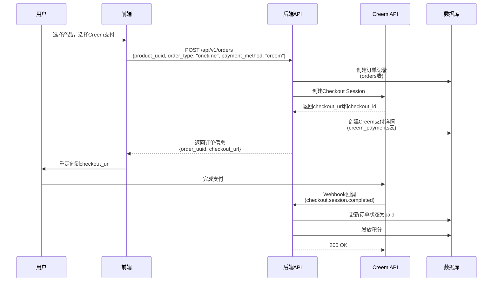
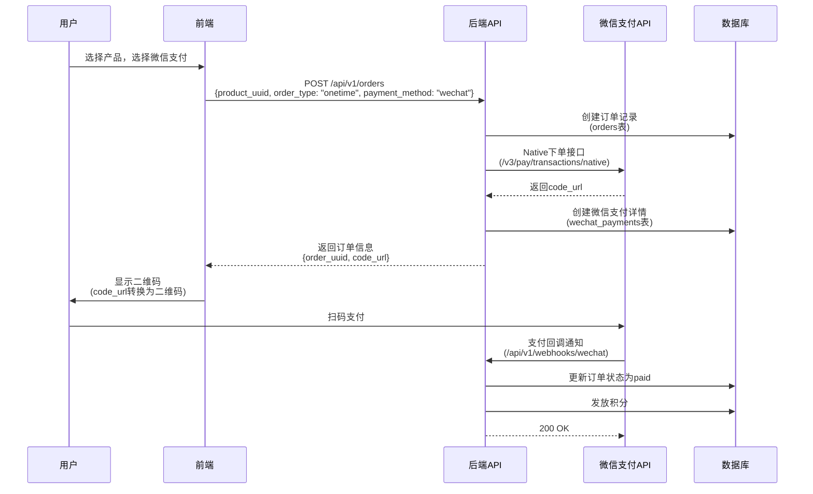
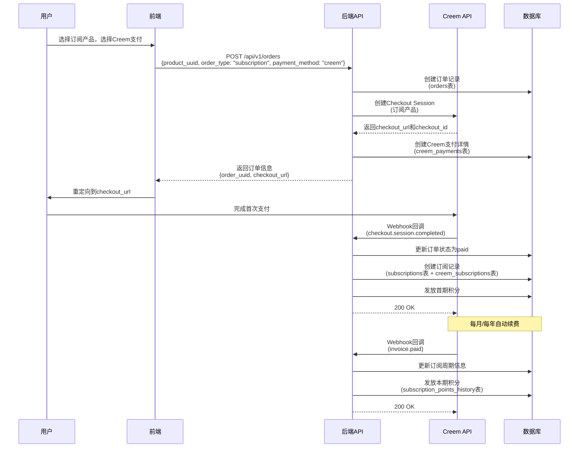
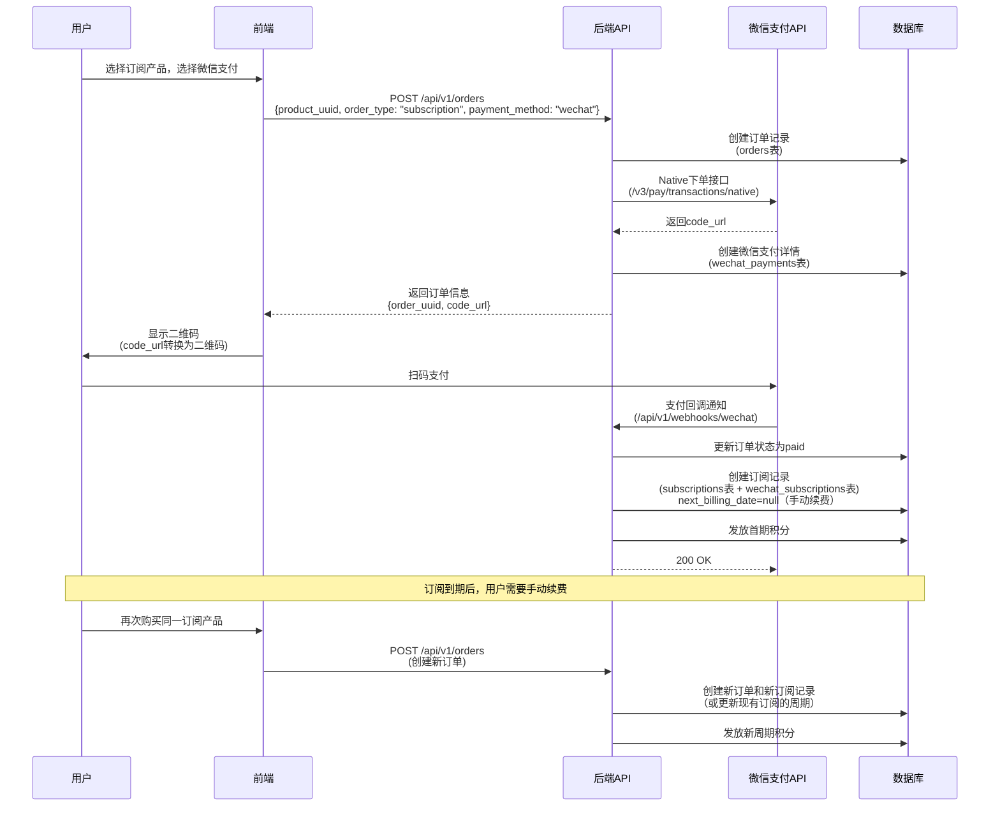

# 统一支付系统接入文档

## 一、概述

本文档描述统一支付系统的设计方案和接入指南。系统设计支持多种支付方式（Creem支付、微信支付等），采用统一的订单表设计，确保内部业务逻辑与支付方式解耦。

### 1.1 设计原则

- **统一订单表**：所有订单使用统一的`orders`表，不包含任何支付方式特定字段
- **支付方式解耦**：每种支付方式使用独立的详情表记录支付相关信息
- **业务逻辑统一**：积分发放、订单状态管理等业务逻辑与支付方式无关
- **易于扩展**：新增支付方式只需添加对应的详情表和服务实现，无需修改订单表

### 1.2 支持的支付方式

- **Creem支付**：支持一次性支付和订阅支付
- **微信支付**：支持Native支付（扫码支付）和订阅支付（支付中签约）

### 1.3 支持的订单类型

- **一次性支付（onetime）**：用户购买积分包，支付成功后立即发放积分
- **订阅支付（subscription）**：
  - **Creem订阅**：按月/按季/按年自动续费并发放积分
  - **微信订阅**：按月/按季/按年手动续费（用户需要手动再次购买），订阅当天发放首期积分，后续积分在每月1号发放

---

## 二、系统架构

### 2.1 数据库表结构

#### 2.1.1 产品表（products）

**设计理念**：产品表支持多语言和多支付方式。同一产品在不同语言和支付方式下可能有不同的价格和描述。

| 字段名 | 类型 | 约束 | 说明 |
|--------|------|------|------|
| `product_id` | INTEGER | PRIMARY KEY | 产品ID（内部） |
| `uuid` | UUID | UNIQUE, NOT NULL, INDEX | 产品公开ID（对外暴露） |
| `payment_method` | VARCHAR(20) | NOT NULL, INDEX | 支付方式：creem, wechat |
| `language` | VARCHAR(10) | NOT NULL, INDEX | 语言代码：zh（中文）, en（英文）, ja（日文）等 |
| `origin_product_id` | VARCHAR(100) | INDEX | 远程产品ID（用于购买对应的远程产品，如Creem需要传递产品ID） |
| `name` | VARCHAR(200) | NOT NULL | 产品名称（多语言） |
| `description` | TEXT | | 产品描述（多语言） |
| `price` | INTEGER | NOT NULL | 价格（分） |
| `currency` | VARCHAR(10) | NOT NULL, INDEX | 货币代码：USD（Creem）, CNY（微信） |
| `billing_type` | VARCHAR(20) | NOT NULL, INDEX | 计费类型：onetime（一次性）、recurring（订阅） |
| `billing_period` | VARCHAR(50) | | 计费周期：every-month（每月）、every-quarter（每季度）、every-year（每年） |
| `points_amount` | INTEGER | NOT NULL | 积分数量 |
| `status` | VARCHAR(20) | NOT NULL, INDEX | 状态：active（激活）、inactive（停用） |
| `image_url` | VARCHAR(500) | | 产品图片URL |
| `product_url` | VARCHAR(500) | | 产品页面URL |
| `features` | JSON | | 产品特性（JSON数组，多语言） |
| `product_metadata` | JSON | | 产品元数据（扩展字段） |
| `created_at` | TIMESTAMP | DEFAULT NOW() | 创建时间 |
| `updated_at` | TIMESTAMP | | 更新时间 |
| UNIQUE(`payment_method`, `language`, `billing_type`, `billing_period`, `points_amount`) | | | 唯一约束：同一支付方式、语言、计费类型、周期、积分的产品唯一 |

**关键设计点**：
- `payment_method`字段标识产品所属的支付方式（creem或wechat）
- `language`字段支持多语言，同一产品可以有不同语言的版本
- `currency`字段根据支付方式自动设置：Creem产品使用USD，微信产品使用CNY
- 产品查询时根据用户语言和支付方式过滤：
  - 中文用户（language=zh）→ 显示微信支付产品（payment_method=wechat, currency=CNY）
  - 其他语言用户（language=en/ja等）→ 显示Creem产品（payment_method=creem, currency=USD）

**产品示例**：

| product_id | payment_method | language | name | price | currency | points_amount |
|------------|----------------|----------|------|-------|----------|--------------|
| 1 | creem | en | Premium Plan | 999 | USD | 1000 |
| 2 | creem | ja | プレミアムプラン | 999 | USD | 1000 |
| 3 | wechat | zh | 高级套餐 | 6999 | CNY | 1000 |
| 4 | wechat | en | Premium Plan | 6999 | CNY | 1000 |

**说明**：
- 同一积分数量（points_amount=1000）的产品，在Creem和微信支付下有不同的价格
- Creem产品使用美元（USD），微信产品使用人民币（CNY）
- 支持多语言，但价格和货币由支付方式决定

#### 2.1.2 统一订单表（orders）

**设计理念**：订单表只包含业务通用字段，不包含任何支付方式特定字段。

| 字段名 | 类型 | 约束 | 说明 |
|--------|------|------|------|
| `order_id` | INTEGER | PRIMARY KEY | 订单ID（内部） |
| `uuid` | UUID | UNIQUE, NOT NULL, INDEX | 订单公开ID（对外暴露） |
| `order_number` | VARCHAR(50) | UNIQUE, NOT NULL, INDEX | 订单号（唯一） |
| `user_id` | INTEGER | FOREIGN KEY → users.user_id, NOT NULL, INDEX | 用户ID |
| `product_id` | INTEGER | FOREIGN KEY → products.product_id, NOT NULL, INDEX | 产品ID |
| `payment_method` | VARCHAR(20) | NOT NULL, INDEX | 支付方式：creem, wechat |
| `order_type` | VARCHAR(20) | NOT NULL, INDEX | 订单类型：onetime, subscription |
| `status` | VARCHAR(20) | NOT NULL, INDEX | 订单状态：pending, paid, failed, cancelled, refunded |
| `amount` | INTEGER | NOT NULL | 订单金额（分） |
| `currency` | VARCHAR(10) | NOT NULL, DEFAULT 'USD' | 货币代码 |
| `points_amount` | INTEGER | NOT NULL | 积分数量 |
| `points_issued` | INTEGER | NOT NULL, DEFAULT 0 | 积分是否已发放（0/1） |
| `success_url` | VARCHAR(500) | | 支付成功回调URL |
| `cancel_url` | VARCHAR(500) | | 支付取消回调URL |
| `paid_at` | TIMESTAMP | | 支付时间 |
| `expires_at` | TIMESTAMP | | 订单过期时间 |
| `order_metadata` | JSON | | 订单元数据（扩展字段） |
| `created_at` | TIMESTAMP | DEFAULT NOW() | 创建时间 |
| `updated_at` | TIMESTAMP | | 更新时间 |

**关键设计点**：
- `payment_method`字段标识支付方式，但不存储支付方式特定信息
- 所有支付方式特定的信息存储在对应的详情表中
- 业务逻辑（积分发放、状态管理）只依赖订单表的通用字段

#### 2.1.3 Creem支付详情表（creem_payments）

| 字段名 | 类型 | 约束 | 说明 |
|--------|------|------|------|
| `payment_id` | INTEGER | PRIMARY KEY | 支付记录ID |
| `uuid` | UUID | UNIQUE, NOT NULL, INDEX | 支付记录公开ID |
| `order_id` | INTEGER | FOREIGN KEY → orders.order_id, UNIQUE, NOT NULL | 关联订单ID |
| `creem_checkout_id` | VARCHAR(100) | UNIQUE, INDEX | Creem Checkout Session ID |
| `creem_transaction_id` | VARCHAR(100) | INDEX | Creem Transaction ID |
| `checkout_url` | VARCHAR(500) | | Creem支付页面URL |
| `payment_metadata` | JSON | | 支付元数据 |
| `created_at` | TIMESTAMP | DEFAULT NOW() | 创建时间 |
| `updated_at` | TIMESTAMP | | 更新时间 |

#### 2.1.4 微信支付详情表（wechat_payments）

| 字段名 | 类型 | 约束 | 说明 |
|--------|------|------|------|
| `payment_id` | INTEGER | PRIMARY KEY | 支付记录ID |
| `uuid` | UUID | UNIQUE, NOT NULL, INDEX | 支付记录公开ID |
| `order_id` | INTEGER | FOREIGN KEY → orders.order_id, UNIQUE, NOT NULL | 关联订单ID |
| `wechat_transaction_id` | VARCHAR(100) | INDEX | 微信支付订单号 |
| `out_trade_no` | VARCHAR(100) | UNIQUE, INDEX | 商户订单号（使用order_number） |
| `code_url` | VARCHAR(500) | | 二维码链接（Native支付） |
| `prepay_id` | VARCHAR(100) | | 预支付交易会话ID |
| `payment_metadata` | JSON | | 支付元数据 |
| `created_at` | TIMESTAMP | DEFAULT NOW() | 创建时间 |
| `updated_at` | TIMESTAMP | | 更新时间 |

#### 2.1.5 统一订阅表（subscriptions）

**设计理念**：订阅表只包含业务通用字段，不包含支付方式特定字段。

| 字段名 | 类型 | 约束 | 说明 |
|--------|------|------|------|
| `subscription_id` | INTEGER | PRIMARY KEY | 订阅ID |
| `uuid` | UUID | UNIQUE, NOT NULL, INDEX | 订阅公开ID |
| `order_id` | INTEGER | FOREIGN KEY → orders.order_id, UNIQUE, NOT NULL | 关联订单ID |
| `user_id` | INTEGER | FOREIGN KEY → users.user_id, NOT NULL, INDEX | 用户ID |
| `payment_method` | VARCHAR(20) | NOT NULL, INDEX | 支付方式：creem, wechat |
| `status` | VARCHAR(20) | NOT NULL, INDEX | 订阅状态：active, cancelled, expired, past_due |
| `billing_period` | VARCHAR(50) | NOT NULL | 计费周期：every-month（每月）、every-quarter（每季度）、every-year（每年） |
| `current_period_start` | TIMESTAMP | | 当前周期开始时间 |
| `current_period_end` | TIMESTAMP | | 当前周期结束时间 |
| `next_billing_date` | TIMESTAMP | | 下次计费时间 |
| `points_per_period` | INTEGER | NOT NULL | 每期积分数量 |
| `last_points_issued_at` | TIMESTAMP | | 最后发放积分时间 |
| `cancel_at_period_end` | BOOLEAN | DEFAULT false | 是否在周期结束时取消 |
| `cancelled_at` | TIMESTAMP | | 取消时间 |
| `subscription_metadata` | JSON | | 订阅元数据 |
| `created_at` | TIMESTAMP | DEFAULT NOW() | 创建时间 |
| `updated_at` | TIMESTAMP | | 更新时间 |

#### 2.1.6 Creem订阅详情表（creem_subscriptions）

| 字段名 | 类型 | 约束 | 说明 |
|--------|------|------|------|
| `subscription_detail_id` | INTEGER | PRIMARY KEY | 订阅详情ID |
| `uuid` | UUID | UNIQUE, NOT NULL, INDEX | 订阅详情公开ID |
| `subscription_id` | INTEGER | FOREIGN KEY → subscriptions.subscription_id, UNIQUE, NOT NULL | 关联订阅ID |
| `creem_subscription_id` | VARCHAR(100) | UNIQUE, INDEX | Creem订阅ID |
| `subscription_metadata` | JSON | | 订阅元数据 |
| `created_at` | TIMESTAMP | DEFAULT NOW() | 创建时间 |
| `updated_at` | TIMESTAMP | | 更新时间 |

#### 2.1.7 微信订阅详情表（wechat_subscriptions）

| 字段名 | 类型 | 约束 | 说明 |
|--------|------|------|------|
| `subscription_detail_id` | INTEGER | PRIMARY KEY | 订阅详情ID |
| `uuid` | UUID | UNIQUE, NOT NULL, INDEX | 订阅详情公开ID |
| `subscription_id` | INTEGER | FOREIGN KEY → subscriptions.subscription_id, UNIQUE, NOT NULL | 关联订阅ID |
| `wechat_contract_id` | VARCHAR(100) | UNIQUE, INDEX | 微信签约协议号 |
| `wechat_plan_id` | INTEGER | | 协议模板ID |
| `wechat_request_serial` | BIGINT | | 请求序列号 |
| `subscription_metadata` | JSON | | 订阅元数据 |
| `created_at` | TIMESTAMP | DEFAULT NOW() | 创建时间 |
| `updated_at` | TIMESTAMP | | 更新时间 |

#### 2.1.8 订阅积分发放历史表（subscription_points_history）

| 字段名 | 类型 | 约束 | 说明 |
|--------|------|------|------|
| `history_id` | INTEGER | PRIMARY KEY | 历史记录ID |
| `uuid` | UUID | UNIQUE, NOT NULL, INDEX | 历史记录公开ID |
| `subscription_id` | INTEGER | FOREIGN KEY → subscriptions.subscription_id, NOT NULL | 关联订阅ID |
| `order_id` | INTEGER | FOREIGN KEY → orders.order_id, NOT NULL | 关联订单ID |
| `user_id` | INTEGER | FOREIGN KEY → users.user_id, NOT NULL | 用户ID |
| `points_record_id` | INTEGER | FOREIGN KEY → points_records.record_id | 积分记录ID |
| `period_start` | TIMESTAMP | NOT NULL | 周期开始时间 |
| `period_end` | TIMESTAMP | NOT NULL | 周期结束时间 |
| `points_amount` | INTEGER | NOT NULL | 发放的积分数量 |
| `issued_at` | TIMESTAMP | DEFAULT NOW() | 发放时间 |
| `payment_method` | VARCHAR(20) | INDEX | 支付方式：creem, wechat |
| `invoice_id` | VARCHAR(100) | INDEX | 发票ID（通用，替代creem_invoice_id） |
| UNIQUE(`subscription_id`, `period_start`) | | | 唯一约束：同一订阅的同一周期只能发放一次 |

### 2.2 表关系图

```
products (产品表)
└── orders (统一订单表) [1:N]
    ├── creem_payments (Creem支付详情) [1:1]
    ├── wechat_payments (微信支付详情) [1:1]
    └── subscriptions (统一订阅表) [1:1]
        ├── creem_subscriptions (Creem订阅详情) [1:1]
        ├── wechat_subscriptions (微信订阅详情) [1:1]
        └── subscription_points_history (订阅积分历史) [1:N]
```

### 2.3 产品与支付方式的关系

**产品分类规则**：

1. **按支付方式分类**：
   - `payment_method = 'creem'`：Creem支付产品，使用USD货币
   - `payment_method = 'wechat'`：微信支付产品，使用CNY货币

2. **按语言分类**：
   - `language = 'zh'`：中文产品
   - `language = 'en'`：英文产品
   - `language = 'ja'`：日文产品
   - 支持其他语言扩展

3. **产品查询逻辑**：
   - 前端根据用户选择的语言（从浏览器语言或用户设置获取）
   - 中文用户（language=zh）→ 查询`payment_method='wechat' AND language='zh'`的产品
   - 其他语言用户（language=en/ja等）→ 查询`payment_method='creem' AND language={language}`的产品
   - 如果当前语言没有对应产品，可以fallback到英文版本

---

## 三、支付流程设计

### 3.1 一次性支付流程

#### 3.1.1 Creem一次性支付



#### 3.1.2 微信Native支付（一次性）



### 3.2 订阅支付流程

#### 3.2.1 Creem订阅支付



#### 3.2.2 微信订阅支付（手动续费）

**重要说明**：微信支付暂时没有资质接入自动续费功能，因此微信订阅采用手动续费模式。



---

## 四、API接口设计

### 4.1 获取产品列表接口

**接口路径**：`GET /api/v1/products`

**查询参数**：

| 参数名 | 类型 | 必填 | 说明 |
|--------|------|------|------|
| `language` | string | 是 | 语言代码：zh, en, ja等 |
| `billing_type` | string | 否 | 计费类型：onetime, recurring |
| `page` | integer | 否 | 页码，默认1 |
| `page_size` | integer | 否 | 每页数量，默认20 |

**业务逻辑**：

1. 根据`language`参数自动确定支付方式：
   - `language = 'zh'` → `payment_method = 'wechat'`
   - `language != 'zh'` → `payment_method = 'creem'`
2. 查询条件：
   - `payment_method = {自动确定的支付方式}`
   - `language = {传入的语言}`
   - `status = 'active'`
   - 如果指定了`billing_type`，则添加该条件
3. 如果当前语言没有产品，fallback到英文版本（`language = 'en'`）
4. 返回产品列表

**响应示例**：

```json
{
  "items": [
    {
      "uuid": "产品UUID",
      "name": "高级套餐",
      "description": "包含1000积分的高级套餐",
      "price": 6999,
      "currency": "CNY",
      "payment_method": "wechat",
      "language": "zh",
      "billing_type": "onetime",
      "points_amount": 1000,
      "image_url": "https://...",
      "features": ["功能1", "功能2"]
    }
  ],
  "total": 1,
  "page": 1,
  "page_size": 20
}
```

**前端使用示例**：

```typescript
// 根据用户语言获取产品列表
const language = getUserLanguage(); // 'zh' 或 'en' 等
const products = await apiClient.get('/api/v1/products', {
  params: { language, billing_type: 'onetime' }
});

// 中文用户会获取微信支付产品（CNY）
// 其他语言用户会获取Creem产品（USD）
```

### 4.2 创建订单接口

**接口路径**：`POST /api/v1/orders`

**请求参数**：

```json
{
  "product_uuid": "产品UUID",
  "order_type": "onetime | subscription",
  "payment_method": "creem | wechat",
  "success_url": "支付成功回调URL（可选）",
  "cancel_url": "支付取消回调URL（可选）",
  "metadata": {} // 订单元数据（可选）
}
```

**响应示例**：

```json
{
  "uuid": "订单UUID",
  "order_number": "订单号",
  "status": "pending",
  "payment_method": "creem",
  "order_type": "onetime",
  "amount": 10000,
  "currency": "USD",
  "points_amount": 1000,
  "payment_info": {
    // Creem支付
    "checkout_url": "https://checkout.creem.io/...",
    // 或微信支付
    "code_url": "weixin://wxpay/bizpayurl/..."
  },
  "created_at": "2025-01-20T10:00:00Z"
}
```

**业务逻辑**：

1. 验证产品是否存在且激活
2. 验证订单类型与产品类型匹配
3. 验证`payment_method`与产品的`payment_method`一致（从产品表获取）
4. 如果是订阅订单，检查用户是否已有活跃订阅：
   - **Creem订阅**：不允许重复购买，如果已有活跃订阅会抛出错误
   - **微信订阅**：允许重复购买（续费就是新订单），不检查现有订阅
5. 创建订单记录（orders表），`payment_method`从产品表获取
6. 根据`payment_method`调用对应的支付服务创建支付
7. 创建对应的支付详情记录（creem_payments或wechat_payments）
8. 返回订单信息和支付信息

**注意**：
- 订单的`payment_method`必须与产品的`payment_method`一致
- 订单的`currency`从产品表获取
- 前端选择产品时，已经确定了支付方式，无需再次指定
- 微信订阅允许重复购买，用于手动续费

### 4.2 查询订单接口

**接口路径**：`GET /api/v1/orders/{order_uuid}`

**响应示例**：

```json
{
  "uuid": "订单UUID",
  "order_number": "订单号",
  "status": "paid",
  "payment_method": "creem",
  "order_type": "onetime",
  "amount": 10000,
  "currency": "USD",
  "points_amount": 1000,
  "points_issued": 1,
  "paid_at": "2025-01-20T10:05:00Z",
  "product": {
    "uuid": "产品UUID",
    "name": "产品名称"
  },
  "payment_detail": {
    // Creem支付详情
    "creem_checkout_id": "...",
    "creem_transaction_id": "..."
    // 或微信支付详情
    // "wechat_transaction_id": "...",
    // "code_url": "..."
  },
  "subscription": {
    // 如果是订阅订单，返回订阅信息
    "uuid": "订阅UUID",
    "status": "active",
    "billing_period": "every-month"
  }
}
```

### 4.3 产品管理

**说明**：
- 产品不再通过API同步，而是通过脚本直接创建到数据库
- Creem产品需要手动设置`origin_product_id`（Creem产品ID）
- 微信产品不需要`origin_product_id`（微信支付不需要传递产品ID）

**产品创建脚本**：
- `scripts/create_test_products.py`：创建测试产品（Creem和微信）
- `scripts/create_wechat_test_products.py`：创建微信测试产品

**产品匹配规则**：
- 通过`points_amount`、`billing_type`、`billing_period`匹配同一产品的不同支付方式版本
- 确保同一积分数量的产品在不同支付方式下价格合理（建议汇率：1 USD = 7 CNY）

### 4.4 支付回调接口

#### 4.3.1 Creem支付回调

**接口路径**：`POST /api/v1/webhooks/creem`

**处理逻辑**：

1. 验证Webhook签名（如果Creem支持）
2. 解析事件类型（checkout.session.completed, invoice.paid等）
3. 根据事件类型处理：
   - `checkout.session.completed`：更新订单状态，发放积分（一次性）或创建订阅（订阅）
   - `invoice.paid`：更新订阅周期，发放本期积分
4. 返回200状态码

#### 4.3.2 微信支付回调

**接口路径**：`POST /api/v1/webhooks/wechat`

**处理逻辑**：

1. 验证回调签名（使用Wechatpay-Signature等请求头）
2. 解密回调数据（resource.ciphertext使用AEAD_AES_256_GCM解密）
3. 解析订单信息（out_trade_no, transaction_id等）
4. 更新订单状态，发放积分或处理订阅
5. 返回200状态码

---

## 五、服务层设计

### 5.1 订单查询服务

**设计理念**：提供统一的订单查询接口，支持多种支付方式的查询。

#### 5.1.1 订单查询服务接口

```python
class OrderQueryService:
    @staticmethod
    def query_order_status(db: Session, order: Order) -> dict:
        """
        查询订单状态
        根据订单的payment_method调用对应的查询服务
        """
        if order.payment_method == "creem":
            return CreemOrderQueryService.query(db, order)
        elif order.payment_method == "wechat":
            return WechatOrderQueryService.query(db, order)
        else:
            raise ValueError(f"不支持的支付方式: {order.payment_method}")
```

#### 5.1.2 Creem订单查询服务

```python
class CreemOrderQueryService:
    @staticmethod
    def query(db: Session, order: Order) -> dict:
        """
        查询Creem订单状态
        """
        creem_payment = order.creem_payment
        if not creem_payment or not creem_payment.creem_checkout_id:
            return {"status": "pending", "updated": False}
        
        # 查询Checkout Session
        checkout = creem_client.get_checkout(creem_payment.creem_checkout_id)
        
        # 判断支付状态
        if checkout.status == "completed":
            # 更新订单状态
            if order.status != "paid":
                OrderService.mark_paid(db, order, ...)
            return {"status": "paid", "updated": True}
        else:
            return {"status": checkout.status, "updated": False}
```

#### 5.1.3 微信订单查询服务

```python
class WechatOrderQueryService:
    @staticmethod
    def query(db: Session, order: Order) -> dict:
        """
        查询微信订单状态
        """
        wechat_payment = order.wechat_payment
        if not wechat_payment:
            return {"status": "pending", "updated": False}
        
        # 使用商户订单号查询
        result = wechat_client.query_order_by_out_trade_no(order.order_number)
        
        # 判断支付状态
        if result.trade_state == "SUCCESS":
            # 更新订单状态
            if order.status != "paid":
                OrderService.mark_paid(
                    db, 
                    order, 
                    wechat_transaction_id=result.transaction_id,
                    paid_at=parse_datetime(result.success_time)
                )
            return {"status": "paid", "updated": True}
        elif result.trade_state == "NOTPAY":
            return {"status": "pending", "updated": False}
        elif result.trade_state == "CLOSED":
            if order.status != "cancelled":
                order.status = "cancelled"
                db.commit()
            return {"status": "cancelled", "updated": True}
        else:
            return {"status": result.trade_state.lower(), "updated": False}
```

### 5.2 订阅查询服务

#### 5.2.1 订阅查询服务接口

```python
class SubscriptionQueryService:
    @staticmethod
    def query_subscription_status(db: Session, subscription: Subscription) -> dict:
        """
        查询订阅状态
        """
        if subscription.payment_method == "creem":
            return CreemSubscriptionQueryService.query(db, subscription)
        elif subscription.payment_method == "wechat":
            return WechatSubscriptionQueryService.query(db, subscription)
        else:
            raise ValueError(f"不支持的支付方式: {subscription.payment_method}")
```

#### 5.2.2 Creem订阅查询服务

```python
class CreemSubscriptionQueryService:
    @staticmethod
    def query(db: Session, subscription: Subscription) -> dict:
        """
        查询Creem订阅状态
        """
        creem_sub = subscription.creem_subscription
        if not creem_sub:
            return {"status": "unknown", "updated": False}
        
        # 查询订阅详情
        sub_data = creem_client.get_subscription(creem_sub.creem_subscription_id)
        
        # 更新订阅信息
        subscription.status = sub_data.get("status", subscription.status)
        subscription.current_period_start = parse_datetime(sub_data.get("current_period_start"))
        subscription.current_period_end = parse_datetime(sub_data.get("current_period_end"))
        subscription.next_billing_date = parse_datetime(sub_data.get("next_transaction_date"))
        
        db.commit()
        return {"status": subscription.status, "updated": True}
```

#### 5.2.3 微信订阅查询服务

```python
class WechatSubscriptionQueryService:
    @staticmethod
    def query(db: Session, subscription: Subscription) -> dict:
        """
        查询微信订阅状态（查询签约关系）
        """
        wechat_sub = subscription.wechat_subscription
        if not wechat_sub or not wechat_sub.wechat_contract_id:
            return {"status": "unknown", "updated": False}
        
        # 查询签约关系
        contract = wechat_client.query_contract(wechat_sub.wechat_contract_id)
        
        # 更新订阅状态
        if contract.contract_state == 0:  # 0: 已签约
            subscription.status = "active"
        elif contract.contract_state == 1:  # 1: 未签约（已解约）
            subscription.status = "cancelled"
            subscription.cancelled_at = parse_datetime(contract.contract_terminated_time)
        else:  # 9: 签约进行中
            subscription.status = "pending"
        
        db.commit()
        return {"status": subscription.status, "updated": True}
```

### 5.3 轮询容错机制

**设计理念**：通过定时任务定期查询待处理订单和订阅，确保即使Webhook失败也能及时更新状态。

#### 5.3.1 订单轮询任务

```python
class OrderPollingTask:
    """
    订单轮询任务
    定期查询pending状态的订单，检查支付状态
    """
    @staticmethod
    def poll_pending_orders(db: Session, max_age_hours: int = 24):
        """
        轮询待支付订单
        - 查询创建时间在3分钟前到24小时内的pending订单
        - 调用对应支付平台的查询接口
        - 更新订单状态，补发积分
        """
        orders = db.query(Order).filter(
            Order.status == "pending",
            Order.created_at >= datetime.now() - timedelta(hours=max_age_hours),
            Order.created_at <= datetime.now() - timedelta(minutes=3)  # 至少3分钟后才查询
        ).all()
        
        for order in orders:
            try:
                result = OrderQueryService.query_order_status(db, order)
                if result.get("updated"):
                    logger.info(f"订单 {order.uuid} 状态已更新: {result['status']}")
            except Exception as e:
                logger.error(f"查询订单 {order.uuid} 失败: {e}")
```

#### 5.3.2 订阅续费轮询任务

```python
class SubscriptionPollingTask:
    """
    订阅续费轮询任务
    在计费日查询订阅的续费状态，补发积分
    """
    @staticmethod
    def poll_subscription_billing(db: Session):
        """
        轮询订阅续费
        - 查询活跃订阅
        - 在计费日查询是否有新的扣款
        - 补发积分
        """
        # 查询需要检查的订阅（在计费日窗口内）
        subscriptions = db.query(Subscription).filter(
            Subscription.status == "active",
            # 在计费日当天或次日
        ).all()
        
        for subscription in subscriptions:
            try:
                # 查询订阅状态
                result = SubscriptionQueryService.query_subscription_status(db, subscription)
                
                # 如果是Creem，查询交易历史
                if subscription.payment_method == "creem":
                    # 查询最近的交易
                    transactions = creem_client.search_transactions(
                        subscription_id=subscription.creem_subscription.creem_subscription_id
                    )
                    # 检查是否有新的已支付交易
                    # 如果有，发放积分
                
                # 如果是微信，查询扣款记录
                elif subscription.payment_method == "wechat":
                    # 微信订阅续费通过申请扣款接口完成
                    # 查询订单状态即可
                    # 通过订单号查询是否有新的续费订单
                    pass
                    
            except Exception as e:
                logger.error(f"查询订阅 {subscription.uuid} 失败: {e}")
```

### 5.5 支付服务工厂

**文件**：`app/services/payment_service_factory.py`

**职责**：根据支付方式创建对应的支付服务实例。

```python
class PaymentServiceFactory:
    @staticmethod
    def get_service(payment_method: str) -> PaymentServiceProtocol:
        if payment_method == "creem":
            return CreemPaymentService()
        elif payment_method == "wechat":
            return WechatPaymentService()
        else:
            raise ValueError(f"不支持的支付方式: {payment_method}")
```

### 5.6 微信订阅手动续费说明

**设计理念**：微信支付暂时没有资质接入自动续费功能，因此微信订阅采用手动续费模式。

**续费流程**：
1. 订阅到期后，用户需要手动再次购买同一订阅产品
2. 系统会创建新订单和新订阅记录（或更新现有订阅的周期）
3. 发放新周期的积分

**订阅特性**：
- `next_billing_date`永远为`null`（不会自动续费）
- `subscription_metadata`中标记`auto_renewal: false`和`renewal_type: "manual"`
- 允许重复购买（用于续费）
- 续费时如果通过`wechat_contract_id`找到现有订阅，会更新现有订阅的周期；如果没找到，会创建新的订阅记录

**注意事项**：
- 微信订阅不支持取消功能（因为没有自动续费，不需要取消）
- 前端应显示"手动续费"标识，提示用户到期后需要手动购买续费

### 5.2 支付服务接口

所有支付服务需要实现以下接口：

```python
class PaymentServiceProtocol(Protocol):
    def create_payment(self, order: Order, **kwargs) -> dict:
        """创建支付，返回支付信息（如checkout_url或code_url）"""
        ...
    
    def query_payment_status(self, order: Order) -> dict:
        """查询支付状态"""
        ...
    
    def handle_callback(self, order: Order, callback_data: dict) -> bool:
        """处理支付回调，返回是否处理成功"""
        ...
```

### 5.3 OrderService重构

**核心方法**：

1. **create_order**：创建订单，根据payment_method调用对应的支付服务
2. **mark_paid**：标记订单为已支付，发放积分（与支付方式无关）
3. **get_order_by_uuid**：查询订单，自动加载对应的支付详情

**关键设计**：

- 订单创建时，根据`payment_method`调用对应的支付服务
- 积分发放逻辑统一，不依赖支付方式
- 订阅创建逻辑统一，支付方式特定信息存储在详情表中

---

## 六、定时任务设计

### 6.1 订单轮询任务

**任务名称**：`poll_pending_orders`

**执行频率**：每3分钟执行一次

**功能**：
- **微信支付订单**：
  - 只查询创建时间在3分钟前到30分钟内的`pending`订单
  - 如果订单超过20分钟未支付，标记为`cancelled`
  - 订单过期时间为20分钟（`time_expire`）
- **Creem支付订单**：
  - 查询创建时间在3分钟前到24小时内的`pending`订单
  - 如果支付未完成，不修改状态，但不再轮询（超过24小时后）
- 调用对应支付平台的查询接口
- 更新订单状态，补发积分

**实现**：

```python
# Celery任务
@celery_app.task
def poll_pending_orders():
    """
    轮询待支付订单
    - 微信订单：只查询30分钟内的订单，超过20分钟未支付标记为cancelled
    - Creem订单：查询24小时内的订单，不修改状态
    """
    db = next(get_db())
    try:
        result = OrderService.poll_pending_orders(db, max_age_hours=24)
        logger.info(f"订单轮询完成: {result}")
    finally:
        db.close()
```

### 6.2 订阅续费轮询任务

**任务名称**：`poll_subscriptions_billing`

**执行频率**：每月1号 00:05 执行

**功能**：
- **只处理Creem订阅**：微信订阅不参与轮询（手动续费，不需要查询支付状态）
- 查询活跃的Creem订阅（`status`为`active`、`past_due`、`scheduled_cancel`、`cancelled`）
- 在每月1号查询订阅的续费状态（查询Creem交易历史）
- 如果发现续费成功但积分未发放，补发积分
- 计算当月周期（每月1号到月底）

**实现**：

```python
# Celery任务
@celery_app.task
def poll_subscriptions_billing():
    """
    轮询订阅续费（只处理Creem订阅）
    在每月1号查询Creem订阅的续费状态，补发积分
    """
    db = next(get_db())
    try:
        result = SubscriptionService.poll_subscriptions_billing(db, max_hours=24)
        logger.info(f"订阅续费轮询完成: {result}")
    finally:
        db.close()
```

### 6.3 订阅积分月度发放任务

**任务名称**：`issue_subscription_points_monthly`

**执行频率**：每月1号 00:10 执行

**功能**：
- 查询所有活跃订阅（Creem和微信）
- 在每月1号发放月度积分
- 订阅当天已发放首期积分，剩余积分在每月1号发放

**实现**：

```python
# Celery任务
@celery_app.task
def issue_subscription_points_monthly():
    """
    订阅积分月度发放
    在每月1号为所有活跃订阅发放月度积分
    """
    db = next(get_db())
    try:
        result = SubscriptionService.run_monthly_payout(db)
        logger.info(f"订阅积分月度发放完成: {result}")
    finally:
        db.close()
```

### 6.4 订阅过期检查任务

**任务名称**：`check_expired_subscriptions`

**执行频率**：每天 01:00 执行

**功能**：
- 查询所有活跃订阅
- 检查`current_period_end`是否已过期
- 如果过期，标记订阅状态为`expired`

**实现**：

```python
# Celery任务
@celery_app.task
def check_expired_subscriptions():
    """
    检查并标记过期的订阅
    """
    db = next(get_db())
    try:
        result = SubscriptionService.check_and_mark_expired_subscriptions(db)
        logger.info(f"订阅过期检查完成: {result}")
    finally:
        db.close()
```

### 6.5 任务调度配置

**Celery Beat配置**：

```python
# celery_beat_schedule
CELERY_BEAT_SCHEDULE = {
    'poll-pending-orders': {
        'task': 'poll_pending_orders',
        'schedule': crontab(minute='*/3'),  # 每3分钟
    },
    'poll-subscriptions-billing': {
        'task': 'poll_subscriptions_billing',
        'schedule': crontab(day_of_month=1, hour=0, minute=5),  # 每月1号 00:05
    },
    'issue-subscription-points-monthly': {
        'task': 'issue_subscription_points_monthly',
        'schedule': crontab(day_of_month=1, hour=0, minute=10),  # 每月1号 00:10
    },
    'check-expired-subscriptions': {
        'task': 'check_expired_subscriptions',
        'schedule': crontab(hour=1, minute=0),  # 每天 01:00
    },
}
```

## 七、配置说明

### 6.1 Creem支付配置

```env
# Creem API配置
CREEM_API_KEY=your_api_key
CREEM_API_URL=https://api.creem.io
CREEM_TIMEOUT=15
CREEM_WEBHOOK_SECRET=your_webhook_secret
CREEM_CHECKOUT_SUCCESS_URL=https://your-domain.com/success
CREEM_CHECKOUT_CANCEL_URL=https://your-domain.com/cancel
```

### 6.2 微信支付配置

```env
# 微信支付配置
WECHAT_APPID=your_appid
WECHAT_MCHID=your_mchid
WECHAT_API_V3_KEY=your_api_v3_key
WECHAT_CERT_SERIAL_NO=your_cert_serial_no
WECHAT_PRIVATE_KEY_PATH=/path/to/private_key.pem
WECHAT_CERT_PATH=/path/to/cert.pem
WECHAT_NOTIFY_URL=https://your-domain.com/api/v1/webhooks/wechat
WECHAT_API_BASE_URL=https://api.mch.weixin.qq.com
```

---

## 八、接入步骤

### 8.1 数据库迁移

1. 执行数据库迁移，创建所有表结构
2. 验证表关系和索引是否正确创建
3. 特别注意产品表的唯一约束：`(payment_method, language, billing_type, billing_period, points_amount)`

### 8.2 产品数据准备

1. **Creem产品同步**：
   - 从Creem API同步产品
   - 为每个产品创建英文、日文等多语言版本（不包括中文）
   - 设置`payment_method='creem'`, `currency='USD'`

2. **微信产品创建**：
   - 手动创建微信支付产品（或通过配置）
   - 为每个产品创建中文、英文等多语言版本
   - 设置`payment_method='wechat'`, `currency='CNY'`
   - 确保同一积分数量的产品价格合理（USD价格转换为CNY）

3. **产品匹配**：
   - 确保同一积分数量（`points_amount`）的产品在不同支付方式下存在
   - 例如：1000积分的产品，Creem版本价格999 USD，微信版本价格6999 CNY

### 8.3 配置支付方式

1. 配置Creem支付参数（如果使用Creem）
2. 配置微信支付参数（如果使用微信支付）
3. 配置回调URL（确保可公网访问）

### 8.4 实现支付服务

1. 实现`CreemPaymentService`（如果使用Creem）
2. 实现`WechatPaymentService`（如果使用微信支付）
3. 实现支付回调处理逻辑

### 8.5 实现查询服务

1. **实现订单查询服务**：
   - 实现`CreemOrderQueryService`
   - 实现`WechatOrderQueryService`
   - 实现统一的`OrderQueryService`接口

2. **实现订阅查询服务**：
   - 实现`CreemSubscriptionQueryService`
   - 实现`WechatSubscriptionQueryService`（查询签约关系，待实现）
   - 实现统一的`SubscriptionQueryService`接口

3. **实现轮询任务**：
   - 实现订单轮询任务（微信订单20分钟过期，Creem订单24小时轮询窗口）
   - 实现订阅续费轮询任务（只处理Creem订阅，每月1号执行）
   - 实现订阅积分月度发放任务（每月1号为所有活跃订阅发放积分）
   - 实现订阅过期检查任务（每天检查并标记过期订阅）

4. **配置定时任务**：
   - 配置Celery Beat调度
   - 确保定时任务正常运行

### 8.6 前端集成

1. **产品列表展示**：
   - 获取用户语言（从浏览器语言或用户设置）
   - 调用产品列表接口，传入`language`参数
   - 系统自动返回对应支付方式的产品（中文→微信，其他→Creem）
   - 显示产品列表，用户无需选择支付方式

2. **订单创建**：
   - 用户选择产品后，直接创建订单
   - 订单的`payment_method`从产品表自动获取，无需前端指定
   - 根据返回的支付信息展示支付页面或二维码

3. **支付方式显示**：
   - 中文用户：显示"微信支付"选项（实际产品已经是微信支付）
   - 其他语言用户：显示"信用卡支付"选项（实际产品已经是Creem支付）
   - 前端可以显示支付方式图标，但实际支付方式由产品决定

---

## 九、扩展新支付方式

### 9.1 添加新支付方式的步骤

1. **创建支付详情表**：如`alipay_payments`表
2. **创建模型**：`app/models/alipay_payment.py`
3. **实现支付服务**：`app/services/alipay_payment_service.py`
4. **更新工厂类**：在`PaymentServiceFactory`中添加新支付方式
5. **实现回调处理**：添加对应的Webhook处理接口

**关键点**：
- 无需修改`orders`表和`subscriptions`表
- 业务逻辑（积分发放、状态管理）保持不变
- 只需实现支付服务接口和回调处理

---

## 十、注意事项

### 10.1 数据一致性

- 订单和支付详情表使用外键约束，确保数据一致性
- 使用数据库事务确保订单和支付详情同时创建或更新

### 10.2 幂等性

- 支付回调需要支持重复调用（微信支付会重试）
- 积分发放需要幂等性检查，避免重复发放

### 10.3 错误处理

- 支付创建失败时，需要回滚订单创建
- 回调处理失败时，需要记录错误日志，支持手动处理

### 10.4 安全性

### 10.5 查询与回调的配合

**设计原则**：
- **主要依赖回调**：Webhook回调是主要的支付状态更新方式
- **查询作为容错**：查询接口用于容错，当回调失败或延迟时使用
- **避免重复处理**：查询和回调都要做幂等性检查，避免重复发放积分

**最佳实践**：
1. 收到回调后立即处理，返回200状态码
2. 定时任务定期查询待处理订单，补发遗漏的积分
3. 查询接口主要用于：
   - 用户主动查询订单状态
   - 定时任务容错
   - 调试和排查问题

**查询频率控制**：
- 订单查询：创建订单3分钟后才开始查询，避免频繁查询
- 订阅查询：每小时查询一次，避免对支付平台造成压力
- 微信支付有频率限制（150qps），需要控制查询频率

- 支付回调需要验证签名，防止伪造请求
- 敏感信息（如私钥）不要存储在代码中，使用环境变量

---

## 十一、测试建议

### 11.1 单元测试

- 测试订单创建逻辑
- 测试支付服务工厂
- 测试积分发放逻辑

### 11.2 集成测试

- 测试完整的支付流程（创建订单→支付→回调→积分发放）
- 测试订阅续费流程
- 测试错误场景（支付失败、回调失败等）

### 11.3 支付沙箱测试

### 11.4 查询接口测试

**测试场景**：
1. **订单查询测试**：
   - 测试pending订单的查询
   - 测试已支付订单的查询
   - 测试查询失败的处理

2. **订阅查询测试**：
   - 测试Creem订阅查询
   - 测试微信签约关系查询
   - 测试查询失败的处理

3. **轮询任务测试**：
   - 测试订单轮询任务
   - 测试订阅续费轮询任务
   - 测试微信订阅续费任务（申请扣款）

4. **容错测试**：
   - 模拟Webhook失败，验证查询能补发积分
   - 模拟查询失败，验证不影响正常流程

- 使用Creem测试环境
- 使用微信支付沙箱环境
- 验证回调处理逻辑

---

## 十二、常见问题

### Q1: 如何切换支付方式？

A: 支付方式由产品决定，不是由用户选择。中文用户看到的是微信支付产品，其他语言用户看到的是Creem产品。前端根据用户语言自动获取对应支付方式的产品。

### Q1.1: 用户能否手动选择支付方式？

A: 可以，但需要前端实现：
- 在产品列表页面，同时显示两种支付方式的产品
- 让用户选择"微信支付"或"信用卡支付"
- 根据用户选择过滤产品列表
- 但建议默认根据语言自动选择，提供手动切换选项

### Q2: 产品价格如何设置？

A: 
- Creem产品使用USD，价格从Creem API同步
- 微信产品使用CNY，价格需要手动设置或通过汇率转换
- 建议：同一积分数量的产品，CNY价格 = USD价格 × 汇率（如7.0）+ 手续费
- 例如：999 USD → 6999 CNY（约7倍）

### Q3: 如何查询订单的支付详情？

A: 通过订单的关联关系自动加载：
- `order.creem_payment`（Creem支付）
- `order.wechat_payment`（微信支付）

### Q4: 订阅续费失败怎么办？

A: 系统会记录续费失败的状态（past_due），可以通过定时任务查询支付状态并补发积分。

### Q5: 如何支持新的支付方式？

A: 参考"扩展新支付方式"章节，创建对应的详情表、模型和服务实现即可。

### Q6: 产品多语言如何处理？

A: 
- 产品表支持`language`字段，同一产品可以有多个语言版本
- 产品查询时根据用户语言过滤
- 如果当前语言没有产品，fallback到英文版本
- 产品名称、描述、特性等字段都支持多语言

### Q7: 如何确保同一产品在不同支付方式下价格合理？

### Q8: Webhook和查询接口的关系是什么？

A: 
- **Webhook是主要方式**：支付平台会主动推送支付结果，这是最快最可靠的方式
- **查询是容错机制**：当Webhook失败、延迟或未收到时，通过查询接口主动获取支付结果
- **两者配合使用**：查询接口确保即使Webhook失败，也能及时更新订单状态和发放积分

### Q9: 微信订阅续费如何实现？

A: 
- **微信订阅不支持自动续费**：由于微信支付暂时没有资质接入自动续费功能，微信订阅采用手动续费模式
- **手动续费流程**：
  - 订阅到期后，用户需要手动再次购买同一订阅产品
  - 系统会创建新订单和新订阅记录（或更新现有订阅的周期）
  - 发放新周期的积分
- **订阅特性**：
  - `next_billing_date`永远为`null`（不会自动续费）
  - `subscription_metadata`中标记`auto_renewal: false`和`renewal_type: "manual"`
  - 允许重复购买（用于续费）

### Q10: 查询接口会重复发放积分吗？

A: 不会。系统做了幂等性检查：
- 订单的`points_issued`字段标记积分是否已发放
- 订阅积分历史表有唯一约束，同一周期只能发放一次
- 查询接口在发放积分前会检查这些标记

### Q11: 订阅积分如何发放？

A: 
- **订阅当天**：发放首期积分（购买时立即发放）
- **后续积分**：在每月1号发放（`issue_subscription_points_monthly`任务）
- **Creem订阅续费**：在每月1号轮询续费状态，如果续费成功则发放积分（`poll_subscriptions_billing`任务）
- **微信订阅**：不参与续费轮询，续费通过用户手动购买完成

### Q12: 如果订阅未过期时再次购买会如何？

A: 
- **Creem订阅**：不允许重复购买，如果已有活跃订阅会抛出错误
- **微信订阅**：允许重复购买（用于手动续费）
  - 如果通过`wechat_contract_id`找到现有订阅，会更新现有订阅的周期
  - 如果没找到，会创建新的订阅记录
  - 每次购买都会发放首期积分

A: 
- 建议建立价格映射表或配置
- 通过`points_amount`匹配同一产品的不同支付方式版本
- 定期检查价格合理性，确保用户体验一致

---

## 十三、产品与支付方式映射示例

### 13.1 产品配置示例

假设有以下产品需求：

| 积分数量 | Creem价格（USD） | 微信价格（CNY） | 说明 |
|---------|-----------------|----------------|------|
| 100 | 9.99 | 69 | 入门套餐 |
| 500 | 49.99 | 349 | 标准套餐 |
| 1000 | 99.99 | 699 | 高级套餐 |
| 2000 | 199.99 | 1399 | 专业套餐 |

**产品表数据示例**：

```sql
-- Creem产品（英文）
INSERT INTO products (payment_method, language, name, price, currency, points_amount, billing_type) 
VALUES ('creem', 'en', 'Premium Plan', 9999, 'USD', 1000, 'onetime');

-- Creem产品（日文）
INSERT INTO products (payment_method, language, name, price, currency, points_amount, billing_type) 
VALUES ('creem', 'ja', 'プレミアムプラン', 9999, 'USD', 1000, 'onetime');

-- 微信产品（中文）
INSERT INTO products (payment_method, language, name, price, currency, points_amount, billing_type) 
VALUES ('wechat', 'zh', '高级套餐', 69900, 'CNY', 1000, 'onetime');

-- 微信产品（英文，供中文用户中的英文用户使用）
INSERT INTO products (payment_method, language, name, price, currency, points_amount, billing_type) 
VALUES ('wechat', 'en', 'Premium Plan', 69900, 'CNY', 1000, 'onetime');
```

### 13.2 前端产品展示逻辑

```typescript
// 前端代码示例
async function getProducts(language: string) {
  // 根据语言自动确定支付方式
  // 中文 → 微信支付产品
  // 其他 → Creem产品
  
  const response = await fetch(`/api/v1/products?language=${language}`);
  const data = await response.json();
  
  // 返回的产品已经根据语言和支付方式过滤
  return data.items;
}

// 使用示例
const userLanguage = getUserLanguage(); // 'zh' 或 'en'
const products = await getProducts(userLanguage);

// 中文用户看到：微信支付产品，价格显示为 CNY
// 英文用户看到：Creem产品，价格显示为 USD
```

### 13.3 产品管理策略

1. **Creem产品创建**（脚本）：
   - 通过`scripts/create_test_products.py`脚本创建产品
   - 手动创建英文、日文等多语言版本
   - 不创建中文版本（中文使用微信产品）
   - 需要手动设置`origin_product_id`为Creem产品ID

2. **微信产品创建**（脚本）：
   - 通过`scripts/create_test_products.py`或`scripts/create_wechat_test_products.py`脚本创建产品
   - 手动创建中文、英文等多语言版本
   - 不需要`origin_product_id`（微信支付不需要传递产品ID）

3. **产品匹配验证**：
   - 定期检查同一积分数量的产品在不同支付方式下是否存在
   - 验证价格合理性（建议汇率：1 USD = 7 CNY）
   - 确保用户体验一致

## 十四、查询接口API参考

### 14.1 微信支付查询接口

#### 14.1.1 商户订单号查询订单

**接口**：`GET /v3/pay/transactions/out-trade-no/{out_trade_no}?mchid={mchid}`

**用途**：通过商户订单号（使用`order.order_number`）查询订单状态

**返回字段**：
- `trade_state`：交易状态（SUCCESS=支付成功，NOTPAY=未支付，CLOSED=已关闭）
- `transaction_id`：微信支付订单号
- `success_time`：支付完成时间

#### 14.1.2 微信订阅续费说明

**注意**：微信支付暂时没有资质接入自动续费功能，因此微信订阅采用手动续费模式。

**续费方式**：
- 用户需要手动再次购买同一订阅产品
- 系统会创建新订单和新订阅记录（或更新现有订阅的周期）
- 发放新周期的积分

**不再使用申请扣款接口**：由于微信订阅不支持自动续费，不再使用`POST /pay/pappayapply`接口。

#### 14.1.3 查询签约关系

**接口**：`POST /papay/querycontract`

**用途**：查询订阅的签约状态

**查询方式**：
- 方式一：使用`contract_id`查询
- 方式二：使用`plan_id` + `contract_code`查询

**返回字段**：
- `contract_state`：协议状态（0=已签约，1=未签约，9=签约进行中）
- `contract_signed_time`：协议签署时间
- `contract_terminated_time`：协议解约时间（如果已解约）

### 14.2 Creem查询接口

#### 14.2.1 查询Checkout Session

**接口**：`GET /v1/checkouts?checkout_id={checkout_id}`

**用途**：通过Checkout ID查询支付状态

**返回字段**：
- `status`：Checkout状态（completed=已完成，pending=待支付）
- `order`：订单信息（包含订单状态）

#### 14.2.2 查询订阅详情

**接口**：`GET /v1/subscriptions/{subscription_id}`

**用途**：查询订阅的详细信息

**返回字段**：
- `status`：订阅状态
- `current_period_start_date`：当前周期开始时间
- `current_period_end_date`：当前周期结束时间
- `next_transaction_date`：下次交易时间

#### 14.2.3 查询交易历史

**接口**：`GET /v1/transactions/search?subscription={subscription_id}`

**用途**：查询订阅的交易历史，用于检查续费

**返回字段**：
- `items`：交易列表
- 每个交易包含：`id`（交易ID）、`status`（状态：paid=已支付）

## 十五、总结

本支付系统设计采用统一订单表 + 支付方式详情表 + 多语言产品表的架构，实现了：

1. **业务逻辑与支付方式解耦**：订单表和订阅表不包含支付方式特定字段
2. **产品与支付方式绑定**：产品表通过`payment_method`字段关联支付方式，确保价格和货币正确
3. **多语言支持**：产品表支持多语言，根据用户语言自动展示对应产品
4. **易于扩展**：新增支付方式只需添加详情表和服务实现，无需修改订单表
5. **数据一致性**：通过外键约束和事务保证数据一致性
6. **统一接口**：所有支付服务实现统一的接口，便于管理和测试

**关键设计亮点**：
- 中文用户自动使用微信支付（CNY），其他语言用户自动使用Creem支付（USD）
- 产品查询根据语言自动过滤，无需前端指定支付方式
- 同一积分数量的产品在不同支付方式下价格合理映射
- **双重保障机制**：Webhook回调 + 查询接口，确保支付状态及时更新
- **容错设计**：定时任务轮询查询，即使Webhook失败也能补发积分
- **订阅续费支持**：
  - Creem订阅：自动续费，通过查询交易历史检查续费状态
  - 微信订阅：手动续费，用户需要手动再次购买（不支持自动续费）
- **积分发放策略**：订阅当天发放首期积分，后续积分在每月1号发放
- **订单过期处理**：微信订单20分钟过期，Creem订单24小时轮询窗口

**查询与回调的配合**：
- Webhook是主要方式，提供最快的支付状态更新
- 查询接口作为容错机制，确保即使Webhook失败也能及时处理
- 定时任务定期查询，补发遗漏的积分
- 所有操作都有幂等性检查，避免重复处理

**微信订阅手动续费设计**：
- 微信订阅不支持自动续费，`next_billing_date`永远为`null`
- 允许重复购买，用于手动续费
- 续费时如果找到现有订阅会更新周期，否则创建新订阅
- 订阅到期后用户需要手动再次购买同一产品来续费

该设计确保了系统的可维护性、可扩展性和可靠性，为未来的业务发展提供了良好的基础。

